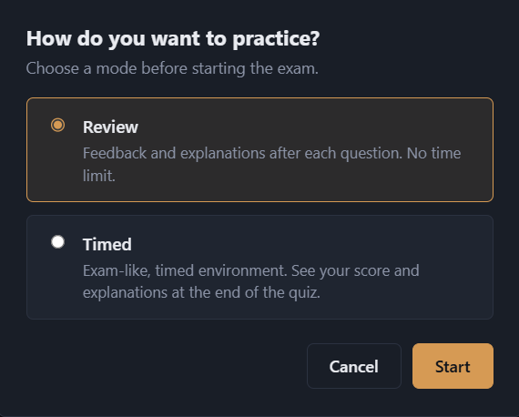
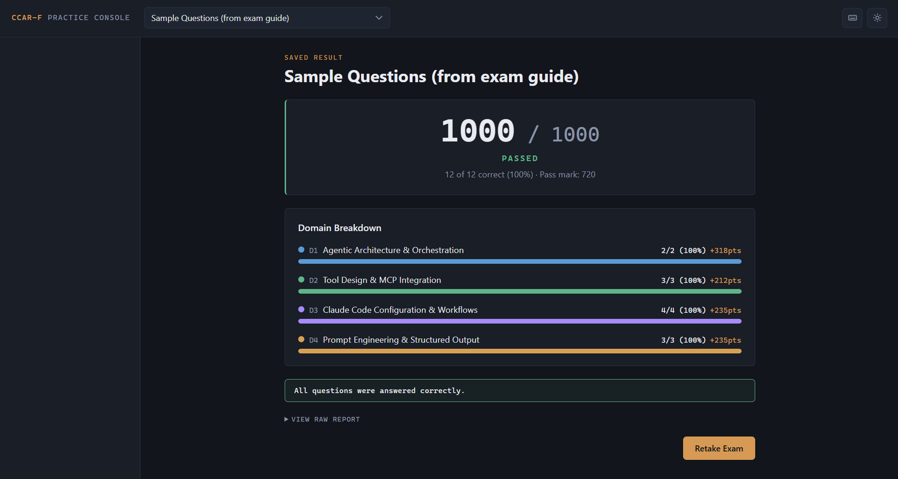
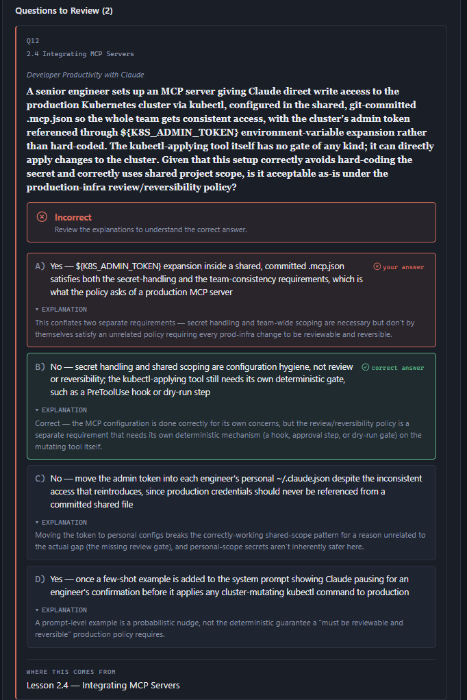

# ExamGenerator

Format and viewer for Claude Certified Architect – Foundations (CCAR-F) practice exams, taken through `ExamSimulator/index.html`. Exams are generated by the `cert-exam-generator` skill from `Notes/` and `Data/` — this folder defines the exam format, the scoring model, and the browser-based simulator that delivers them. The formats below are the simulator's parser contract; the skill produces files that match them, and they're documented here for reference (and for the rare hand-edit).

## Layout

```
ExamGenerator/
├── ExamSimulator/           Browser-based exam simulator (ES modules, no build step)
│   ├── index.html           Entry point — markup + linked styles/ and js/
│   ├── styles/              CSS split by concern: tokens, base, layout, card, results, modal
│   └── js/                  ES modules: constants, state, utils, parse, scoring, result-md,
│                              theme, timer, storage, catalog, exam, render, main
└── GeneratedExams/
    ├── manifest.json        Flat JSON array of every exam id shown in the simulator's picker — derived, not hand-maintained; run `node scripts/sync-manifest.js` to regenerate it
    ├── <id>/
    │   ├── exam.md          Questions
    │   ├── answer-key.md    Correct answers + per-option rationale + sources
    │   └── result.md        Saved run — written by the simulator, read back as the review
    │                          screen, and gitignored (personal scores stay local)
    └── _sample/             Format reference — registered in manifest.json like any other id,
                              so it's also browsable/selectable in the simulator
```

## The simulator (`ExamSimulator/`)

Self-contained, no build step: `index.html` loads ES modules directly, and the only runtime requirement is a static file server. There are no dependencies to install and nothing to compile.

### Opening an exam

`selectExam()` in `exam.js` is the entry point for every exam, and it branches on a single question — does a saved result exist?

```
selectExam(id)
  └─ fetch("<id>/result.md")
       ├─ 200 → state.view = "saved-result"   (parse the file, render the review)
       └─ 404 → showModeModal(id)             (no result yet, so start fresh)
```

There is no separate record of which exams you've attempted. The file's existence *is* that record, which is why **Retake** is implemented as `deleteSavedResult(id)` followed by re-opening the mode prompt — remove the artifact and the probe misses again. It also means you can hand an exam back to a clean state by deleting one file, and that copying a `result.md` into a folder is enough to make the simulator render it.

### Practice modes

When no saved result exists, the mode prompt decides **when the answer key is fetched** — not what gets scored:



- **Review** (default) — `startFreshExam()` eagerly fetches `answer-key.md` before rendering, because feedback has to be available the moment you commit to an answer. Confirming a question grades it immediately, and the running tally in the header is computed from the same `isCorrect()` used for the final score. Confirming the last unanswered question finishes the exam.
- **Timed** — the key is *not* fetched. `finishExam()` requests it lazily at the end, so for the entire duration of a timed run the browser has never downloaded the correct answers. Timer length is derived rather than configured: `questionCount × 2 minutes`, so exam length scales itself. Expiry calls `finishExam(true)`, which skips the unanswered-questions confirmation and submits as-is.

Both modes score identically — unanswered questions count as incorrect, matching the real exam's no-penalty-for-guessing rule — and both write the same `result.md`. Flags are navigation aids only and never enter scoring.

### Module layout

`index.html` carries only the static markup; the look and behavior are split into small files:

- **`styles/`** — the CSS, grouped by concern: `tokens.css` (theme variables), `base.css` (reset), `layout.css` (header + navigator + main), `card.css` (question card + choices + buttons), `results.css` (results + saved-result review), `modal.css` (mode modal + responsive).
- **`js/`** — ES modules with a single responsibility each: `constants.js` (domain taxonomy, weights, `BASE` fetch path), `state.js` (shared mutable state + DOM refs), `utils.js` (escaping, `fetchText`), `parse.js` (`exam.md` / `answer-key.md` parsers), `scoring.js` (1000-point weighted scoring), `result-md.js` (the `result.md` build/parse pair), `theme.js`, `timer.js`, `storage.js` (File System Access autosave), `catalog.js` (manifest + picker), `exam.js` (lifecycle + mode modal + save actions), `render.js` (all views), and `main.js` (entry point that boots everything).

## Adding a new exam

Ask the `cert-exam-generator` skill (`.claude/skills/cert-exam-generator/`) to generate one — e.g. *"generate a new practice exam"*. It asks at most two things (how many questions, and which domains — a focus or a weighted spread), then writes `GeneratedExams/<id>/exam.md` + `answer-key.md` in the formats below, applies the CCAR-F question-quality rubric, registers the id, and regenerates `manifest.json`.

`manifest.json` is derived, never hand-edited — it exists because browsers can't list a directory over `fetch()`. It's regenerated from disk by `node scripts/sync-manifest.js` (which the skill runs for you).

To write an exam by hand instead, copy `_sample/` and follow the formats below, then run:

```
node scripts/sync-manifest.js     # register the id
node scripts/validate-exams.js    # check it against the formats below
```

### Validation

The formats below are a parser contract, and breaking one usually fails quietly — the simulator drops a question, mislabels a domain, or renders a blank scenario badge rather than raising anything. `scripts/validate-exams.js` makes those failures loud: it walks every id in `manifest.json` and checks the header lines, `Total` against the actual question count, sequential `## Q<n>` numbering, domain names against the taxonomy, subtopic ids and their spelling, non-empty `Scenario:` values, exactly four `A)`–`D)` choices, that `exam.md` and `answer-key.md` agree on the question set, and that every `Correct:` letter points at a choice that exists.

Errors exit non-zero. Warnings (single-paragraph stems, partial `Why-` sets, a missing `Source:`, a correct-letter distribution skewed to one letter) are reported but don't fail — pass `--strict` to promote them.

It has no canonical list of subtopic *names* to check against, because the repo doesn't define one; instead it requires that every exam spells a given subtopic id the same way, which catches drift without freezing the wording.

Two things run it for you: `.github/workflows/validate-exams.yml` on every push and pull request, and the tracked pre-commit hook (`.githooks/pre-commit`), which also re-derives `manifest.json` and blocks any commit where it doesn't match the folders on disk. The hook needs one-time setup per clone, since git doesn't honor `.githooks/` until you point it there:

```
git config core.hooksPath .githooks
```

## Domain taxonomy

Fixed, matches the rest of the repo (`Notes/`) and the real CCAR-F weightings:

| # | Domain | Weight |
|---|--------|--------|
| 1 | Agentic Architecture & Orchestration | 27% |
| 2 | Tool Design & MCP Integration | 18% |
| 3 | Claude Code Configuration & Workflows | 20% |
| 4 | Prompt Engineering & Structured Output | 20% |
| 5 | Context Management & Reliability | 15% |

## `exam.md` format

All content in English. The simulator (`ExamSimulator/js/parse.js`) parses this line-by-line with fixed rules — keep the shape exact. `Subtopic:` and `Scenario:` are optional metadata lines that, when present, must come immediately after `Domain:` (in that order). Files without them still parse; the card just falls back to the domain-level label.

```markdown
# Exam <id>

Title: <short descriptive title>
Total: <question count>

## Q1
Domain: 1. Agentic Architecture & Orchestration
Subtopic: 1.4 Workflow Enforcement & Handoff
Scenario: Customer Support Resolution Agent

<Question stem — scenario + question, one or more lines/paragraphs>

A) <choice A>
B) <choice B>
C) <choice C>
D) <choice D>

## Q2
Domain: 5. Context Management & Reliability
Subtopic: 5.1 Managing Conversation Context
Scenario: Multi-Agent Research System

...
```

- Question blocks start with `## Q<n>` (sequential, starting at 1).
- The `Domain:` line must start with the domain number followed by `.` and match the taxonomy above.
- `Subtopic:` (optional) is `<d.s> <name>`, e.g. `1.4 Workflow Enforcement & Handoff` — the `<d.s>` id drives the section number shown on every card.
- `Scenario:` (optional) is a short scenario-family title shown in the card badge.
- Exactly four choices, `A)` through `D)`.

## `answer-key.md` format

One entry per question. Every field is a single line (no hard breaks). `Correct:` and `Explanation:` are required; `Why-A`…`Why-D` (per-option rationale) and `Source:` (one or more lesson references) are optional but recommended — the simulator renders them in the post-exam review and the saved report.

```markdown
## Q1
Correct: B
Explanation: <short summary rationale>
Why-A: <why A is wrong>
Why-B: <why B is correct>
Why-C: <why C is wrong>
Why-D: <why D is wrong>
Source: Lesson 1.4 — Workflow Enforcement & Handoff

## Q2
Correct: D
Explanation: <short summary rationale>
```

Domain/subtopic/scenario live only in `exam.md`; correctness, rationale, and sources live only in `answer-key.md` — the simulator cross-references the two by `Q<n>`.

Unanswered questions are scored as incorrect (no penalty for guessing), matching the real exam's rule.

## `result.md` format

Written automatically by the simulator after a run — not authored by the exam-generator skill, and not something you write by hand under normal use. The simulator parses a saved `result.md` back into a rich review screen whenever that exam is reopened, so this shape is a parser contract, not just a report style. See `GeneratedExams/_sample/result.md` for a full worked example.

```markdown
# QUESTIONS

## 1. Agentic Architecture & Orchestration (1/1)

> 🟢 Evaluation: 1/1 (All questions were answered correctly.)

---

## 3. Claude Code Configuration & Workflows (1/1)

> 🟢 Evaluation: 1/1 (All questions were answered correctly.)

---

## 5. Context Management & Reliability (0/1)

### 5.1 Managing Conversation Context
**Q2** · your answer: A · correct: C

<question stem>

- 🔴 Your answer (A): <raw choice A text>
- B) <raw choice B text>
- 🟢 Correct (C): <raw choice C text>
- D) <raw choice D text>

Why-A: <one-line rationale for A>
Why-B: <one-line rationale for B>
Why-C: <one-line rationale for C>
Why-D: <one-line rationale for D>

**Where this comes from:** Lesson 5.1 — Managing Conversation Context

---

# RESULT

**Score:** 758/1000 · PASSED · 2 of 3 correct (67%) · Pass mark: 720

| Domain | Correct | Points |
|--------|---------|--------|
| D1 Agentic Architecture & Orchestration | 1/1 (100%) | +435 |
| D3 Claude Code Configuration & Workflows | 1/1 (100%) | +323 |
| D5 Context Management & Reliability | 0/1 (0%) | +0 |
```

Rules:
- Two top-level sections, in order: `# QUESTIONS` (one block per domain present in the exam) then `# RESULT` (score summary + table).
- A domain answered perfectly gets a single `> 🟢 Evaluation: <correct>/<total> (All questions were answered correctly.)` blockquote and no question detail. A domain with any miss instead lists every missed question in that domain.
- Each missed question: an optional `### <d.s> <Subtopic name>` heading, then `**Q<n>** · your answer: <letter> · correct: <letter>`, a blank line, the question stem, then exactly one bullet per available choice (`A)`–`D)`) — tagged 🔴/🟢 for your answer / the correct answer — showing that option's **raw choice text**, never its explanation.
- Immediately after the bullets (separated by a blank line), one `Why-<letter>:` line per available choice with that option's one-line rationale. Keep this block separate from the bullets above it — folding the explanation into the bullet text instead of its own `Why-<letter>:` line breaks the review screen's per-choice explanation toggle (each choice always shows its raw text; the explanation is revealed on click, correct/your-answer included).
- `**Where this comes from:**` is optional, one line, joining all sources with `; `.
- `# RESULT` has one `**Score:** <score>/<total> · PASSED|FAILED · <correct> of <totalQ> correct (<pct>%) · Pass mark: <pass>` line, then a `| Domain | Correct | Points |` table with one row per domain present in the exam.
- All of this is generated verbatim by `buildResultMarkdown()` and read back by `parseResultReport()`, both in `ExamSimulator/js/result-md.js`. If you ever hand-edit or hand-author a `result.md`, match this shape exactly.

## Scoring

Scoring is domain-weighted and scaled to **1000 points**. Each domain present in the exam contributes `1000 × weight / (sum of present weights)` points, earned in proportion to the fraction correct in that domain. With all five domains present the maxima are 270 / 180 / 200 / 200 / 150. The **pass mark is 72%** (720 / 1000). Domains with no questions in an exam are excluded and the remaining weights renormalize.

Because the score is renormalized over the domains actually present, a single-domain drill still reports out of 1000 — the number stays comparable to the real exam's cut score no matter how narrow the exam is.



## Reviewing answers

Review is driven by the answer key's per-option fields, so the reviewable unit is the *option*, not the question: every choice carries its own rationale, including the ones you rejected. That's the difference between learning why you were wrong and learning why the distractor was tempting.



Two constraints follow from this and are easy to break by accident:

- **Raw choice text and rationale must stay separate.** Each option renders its verbatim text from `exam.md`; the `Why-<letter>:` line from `answer-key.md` is revealed on demand. Folding a rationale into the choice text — in `answer-key.md` or in a hand-edited `result.md` — collapses the two and the per-option reveal stops working.
- **Sources are the audit trail.** The `Source:` lines become the "where this comes from" reference, tying the question back to the note that justifies its answer. The generator skill treats an unsourceable question as one that shouldn't ship, so a missing source is a signal, not a cosmetic gap.

The same renderer serves a live post-exam review and a `result.md` reopened weeks later — the saved report is parsed back into the identical view, so nothing is lost by closing the tab.

## Saving results

When a run finishes, `autoSaveResult()` writes the report to `GeneratedExams/<id>/result.md` through the File System Access API. The directory handle you grant is persisted in IndexedDB (`examgen-fs` → `handles` → `genExamsDir`) and its permission re-verified on later visits, so authorization is a one-time step per browser rather than per run.

This only works in Chromium-based browsers on localhost. Elsewhere the write fails loudly rather than silently, and two format-identical fallbacks stay available: **Copy report** (clipboard) and **Download result.md** (drop it into the exam folder yourself). **Save to file…** re-runs the picker if you want to write it again manually.

Two consequences worth stating plainly:

- **Saved results are gitignored.** `.gitignore` excludes `GeneratedExams/*/result.md`, so your scores never enter version control. The one negated exception is `_sample/result.md`, kept because it is the synthetic worked example this document's format contract points at.
- **On browsers without the API, retake is a no-op.** `deleteSavedResult()` resolves without doing anything when `showDirectoryPicker` is absent. In practice that's consistent — such a browser could never have autosaved a result either — but if you manually placed a `result.md`, you'll need to delete it manually too.

## Running the simulator

Browsers block `fetch()` of local files opened via `file://` (and ES modules only load over `http(s)`), so serve this folder over a tiny local static server, then open the simulator in the browser:

```
npx serve ExamGenerator
# or
python -m http.server --directory ExamGenerator 5500
```

Then visit the printed localhost URL and open `ExamSimulator/index.html`.
