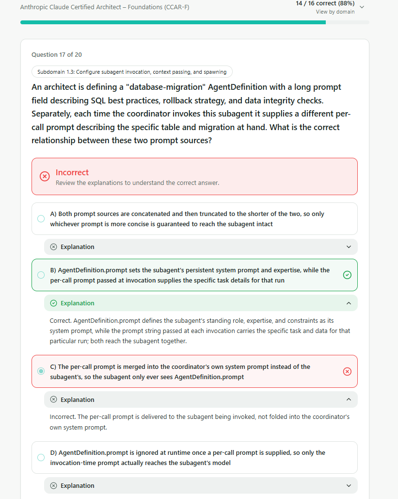
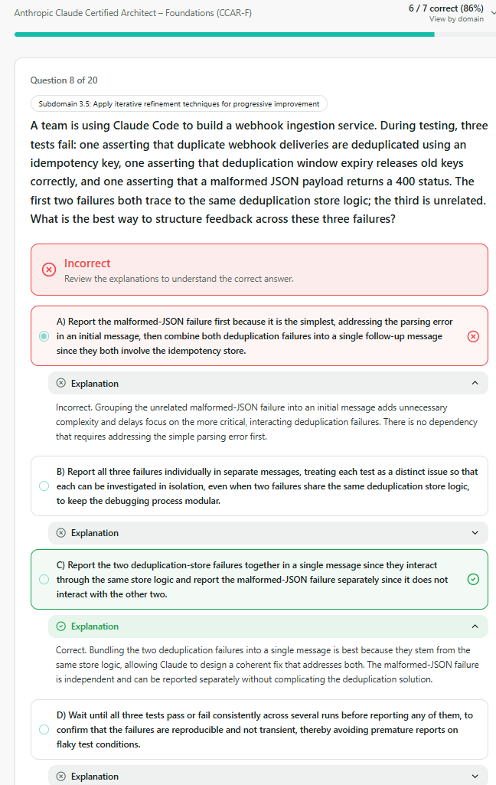
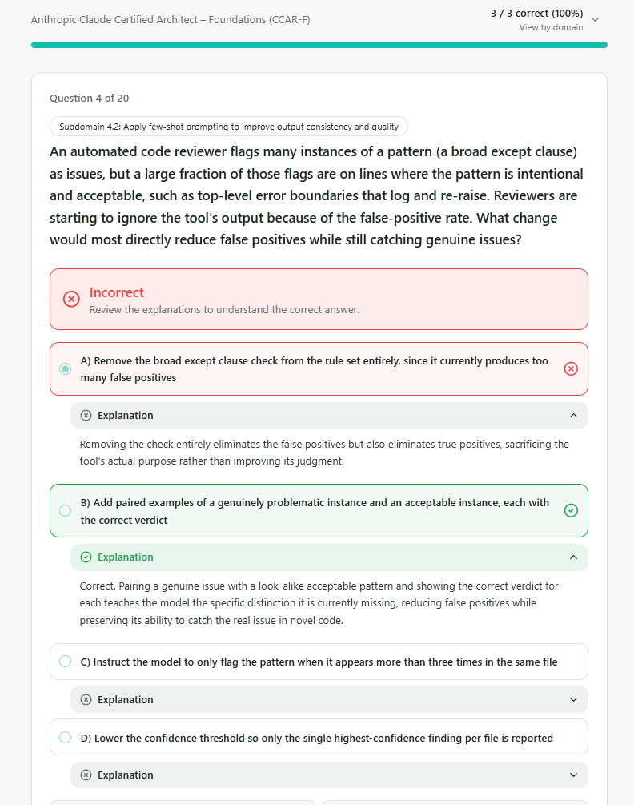
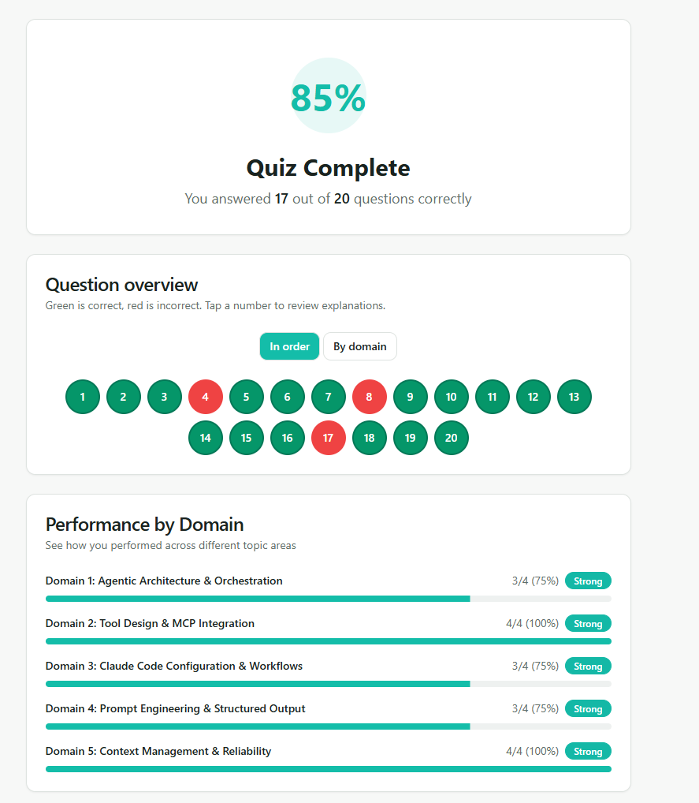

# QUESTIONS

## 1.Agentic Architecture & Orchestration (3/4)
### 1.3 Subagent Invocation & Context Passing

### Inferences:

- It was overlooked. There is no need to take notes.

---
## 2.Tool Design & MCP Integration (4/4)

> 🟢 **Evaluation:** 4/4 (All questions were answered correctly.)

---

## 3.Claude Code Configuration & Workflows (3/4)
### 3.5 Iterative Refinement Techniques

### Inferences:

- *Simplicity* is **NOT** a *prioritization* criterion.

- The correct criterion to use when **grouping** feedback is whether the issues *interact with one another*.

- The **first** message should be dedicated to the most critical and pressing issue.
---

## 4.Prompt Engineering & Structured Output (3/4)

### 4.2 Few-Shot Prompting

### Inferences:

- It was overlooked. There is no need to take notes.

---

## 5.Context Management & Reliability (4/4)

> 🟢 **Evaluation:** 4/4 (All questions were answered correctly.)

---

# RESULT

---
