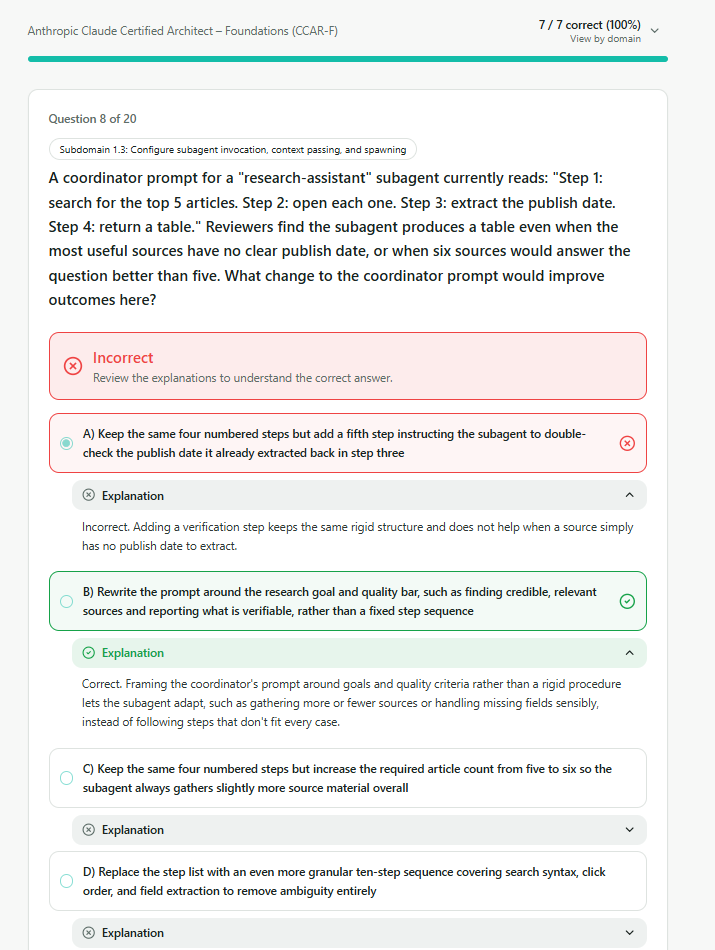
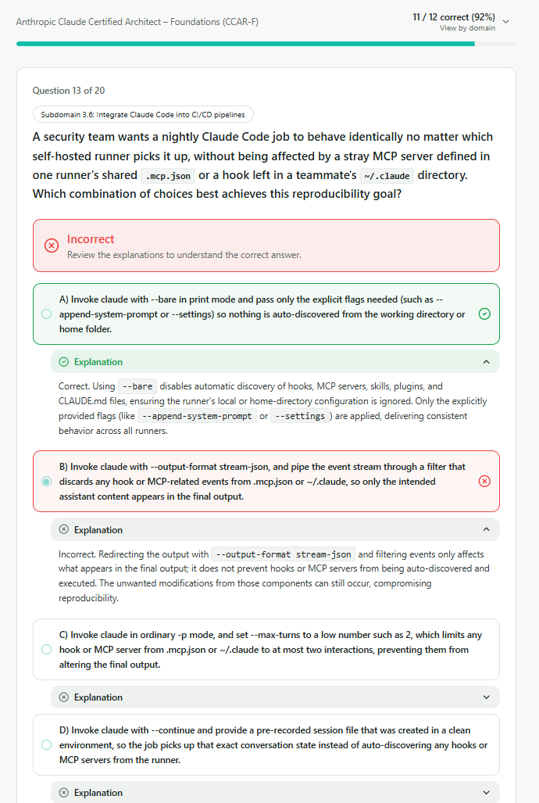
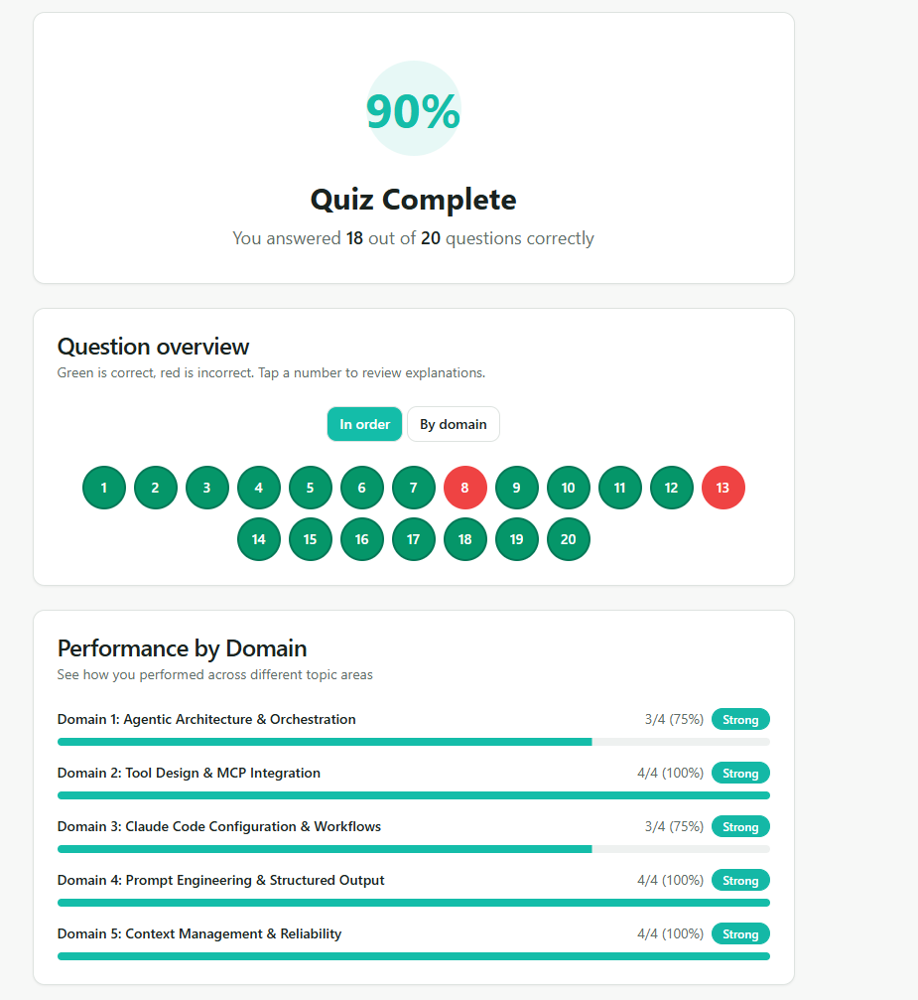

# QUESTIONS

## 1.Agentic Architecture & Orchestration (3/4)
### 1.3 Subagent Invocation & Context Passing

### Inferences:

- Don't give the subagent: steps, rigid procedure
- Give it: goals and quality criteria

---
## 2.Tool Design & MCP Integration (4/4)

> 🟢 **Evaluation:** 4/4 (All questions were answered correctly.)

---

## 3.Claude Code Configuration & Workflows (3/4)
### 3.6 Integrating Claude Code into CI/CD

### Inferences:

- **--output-format-stream-json**: Effects just output format
- **--bare**: Disables automatic discovery of hooks.

---

## 4.Prompt Engineering & Structured Output (4/4)

> 🟢 **Evaluation:** 4/4 (All questions were answered correctly.)

---

## 5.Context Management & Reliability (4/4)

> 🟢 **Evaluation:** 4/4 (All questions were answered correctly.)

---

# RESULT

---
