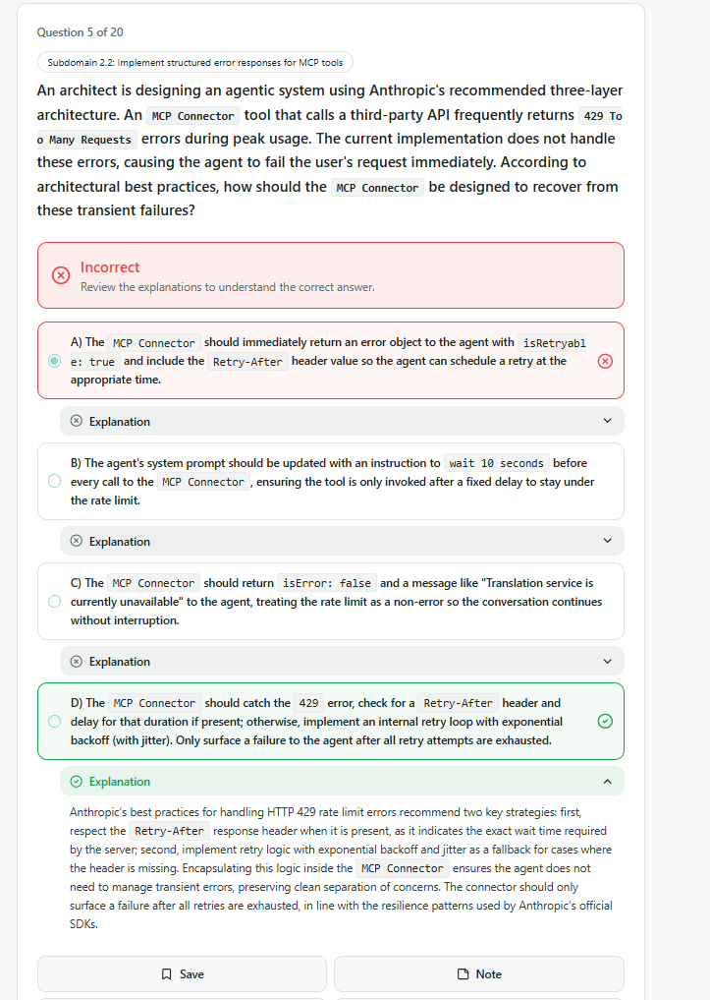
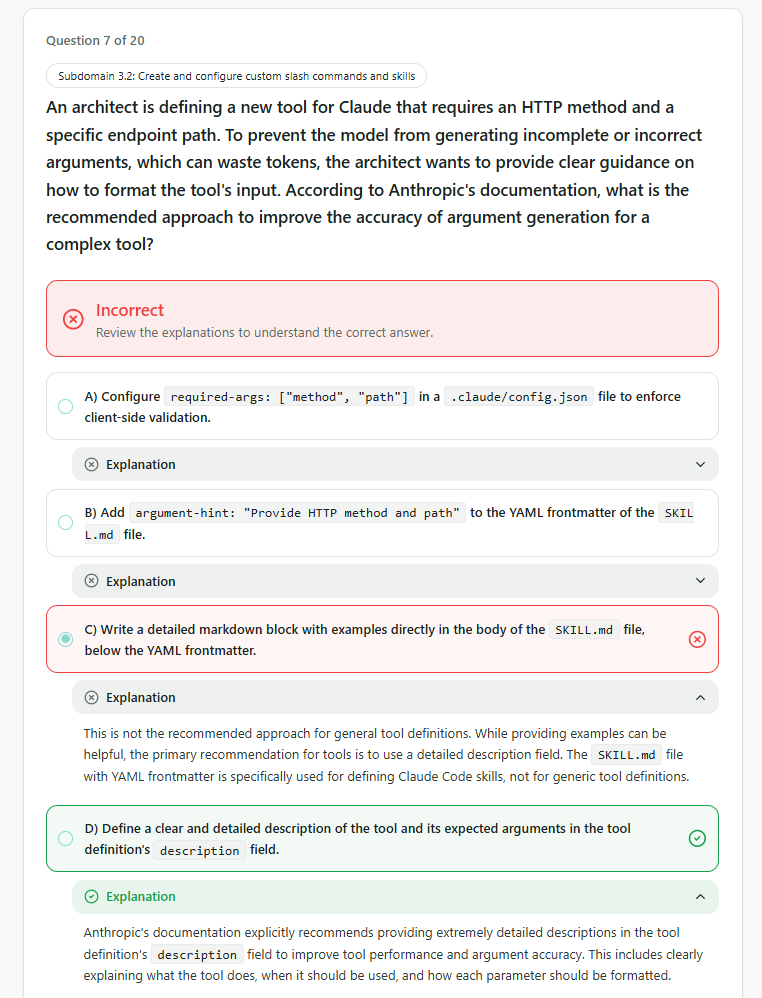
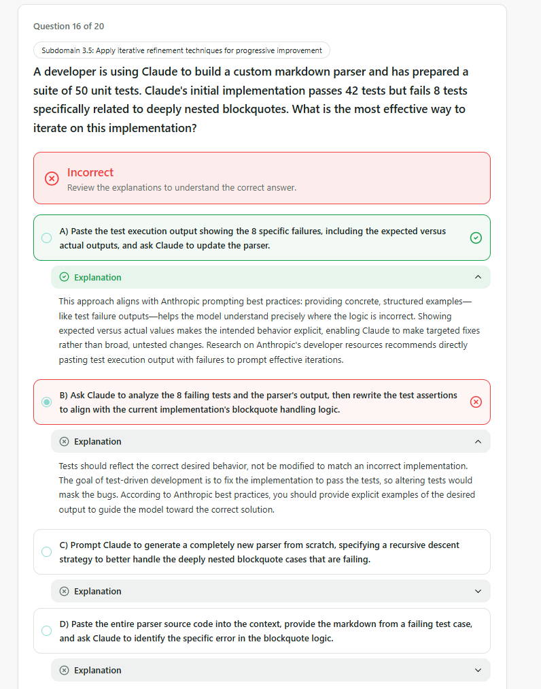
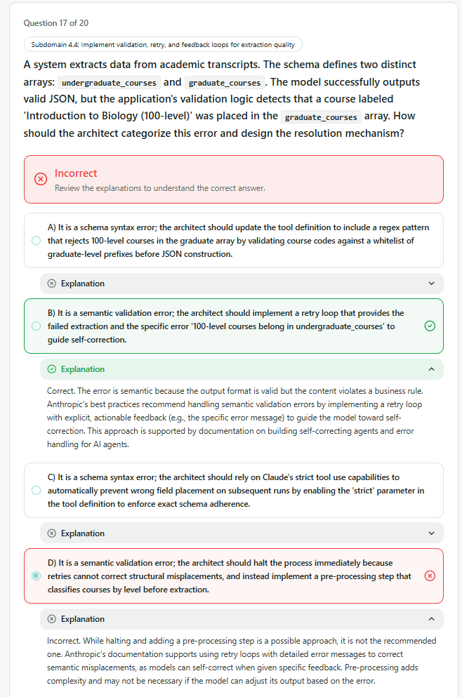
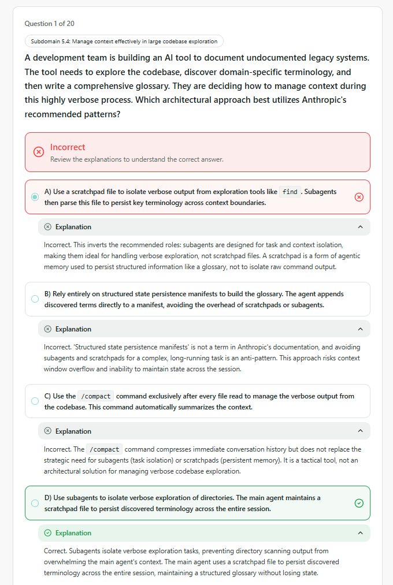
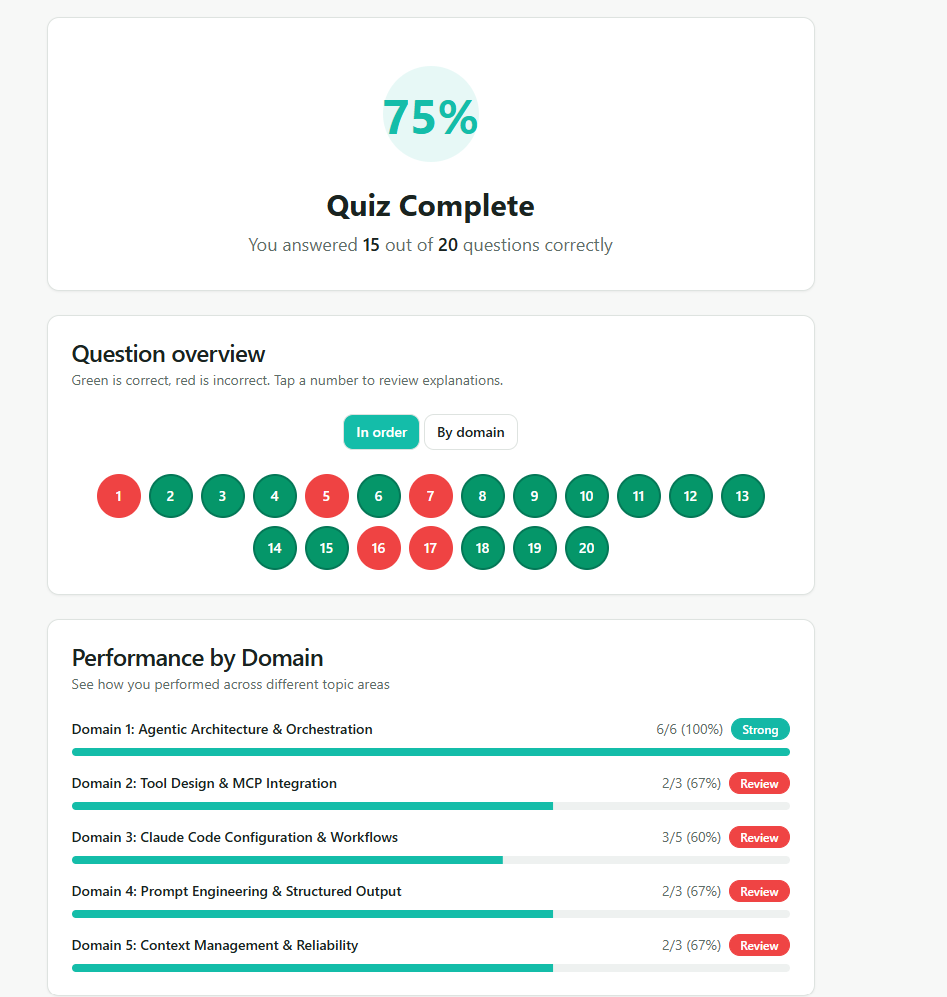

# QUESTIONS

## 1.Agentic Architecture & Orchestration (6/6)

> 🟢 **Evaluation:** 6/6 (All questions were answered correctly.)

## 2.Tool Design & MCP Integration (2/3)

### 2.2 Structured Error Responses

### Inferences:

- Immediately *returning* error object is **wrong** when a *retryable* error occurred.

---

## 3.Claude Code Configuration & Workflows (3/5)
### 3.2 Custom Slash Commands & Skills

### Inferences:

- To improve **tool** performance and **argument** accuracy: *Better Description* 

---

### 3.5 Iterative Refinement Techniques

### Inferences:

- It was overlooked. There is no need to take notes.

---

## 4.Prompt Engineering & Structured Output (2/3)

### 4.4 Validation & Retry Loops

### Inferences:

- It was overlooked. There is no need to take notes.

---

## 5.Context Management & Reliability (2/3)

### 5.4 Context in Large Codebase Exploration

### Inferences:

- Subagents: Designed for tasks and context isolation.
- Scratchpad Files: Persist structured information like a gloassary. 

---

# RESULT

---
