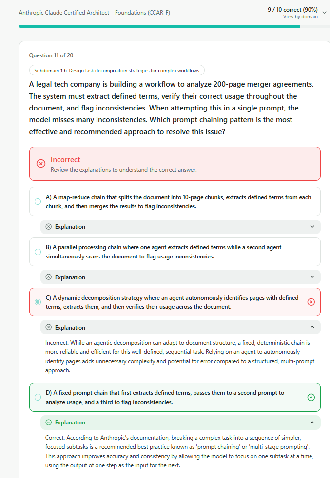
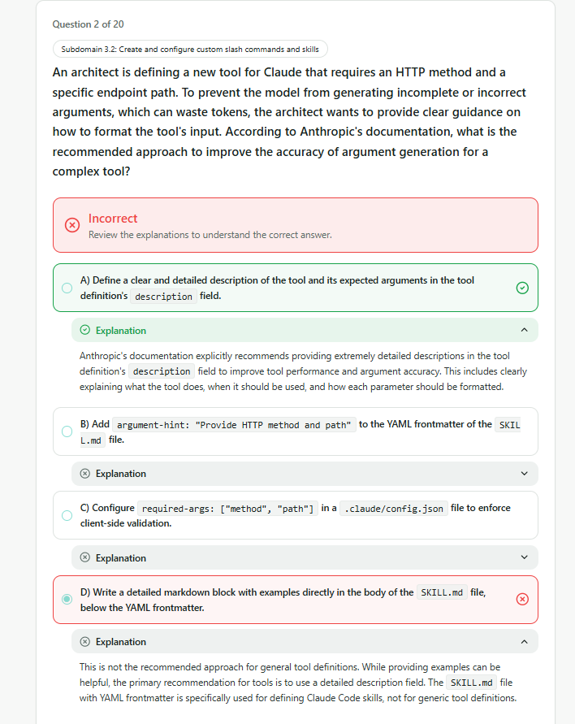
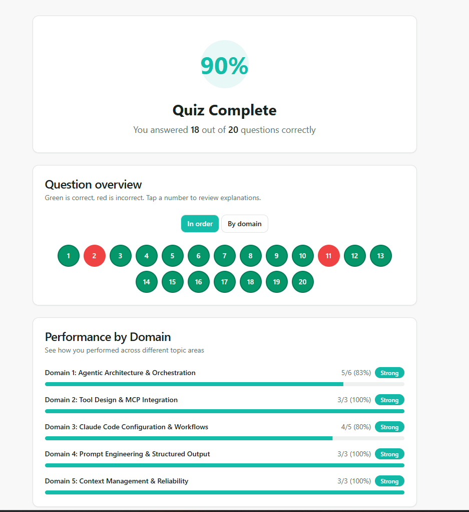

# QUESTIONS

## 1.Agentic Architecture & Orchestration (5/6)
### 1.6 Task Decomposition Strategies

### Inferences:

- **Prompt-chaining** : Breaking a complex task into a sequence of simpler, focused subtasks is a recommended best practice.  
- Dynamic decomposition is not good for a deterministic chain.

---

## 2.Tool Design & MCP Integration (3/3)

> 🟢 **Evaluation:** 6/6 (All questions were answered correctly.)

## 3.Claude Code Configuration & Workflows (4/5)
### 3.2 Custom Slash Commands & Skills

### Inferences:

- To improve **tool** performance and **argument** accuracy: *Better Description* 
- ⚠️ This is the same question: Exam 1 - Question 7

---

## 4.Prompt Engineering & Structured Output (3/3)

> 🟢 **Evaluation:** 3/3 (All questions were answered correctly.)

## 5.Context Management & Reliability (3/3)

> 🟢 **Evaluation:** 3/3 (All questions were answered correctly.)

# RESULT

---
