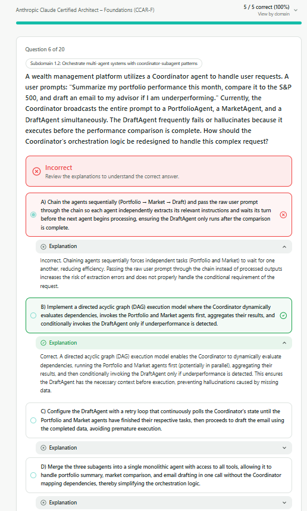
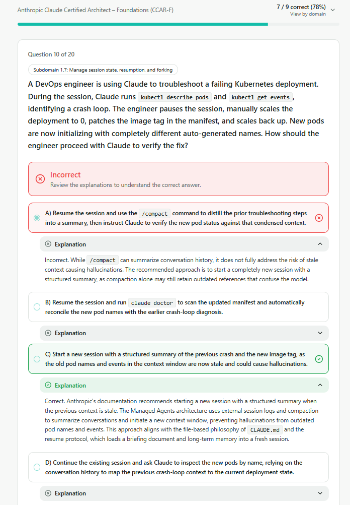
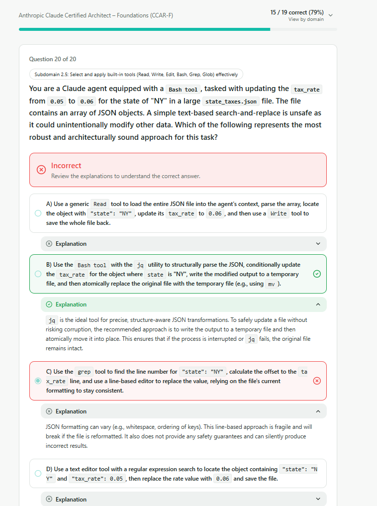
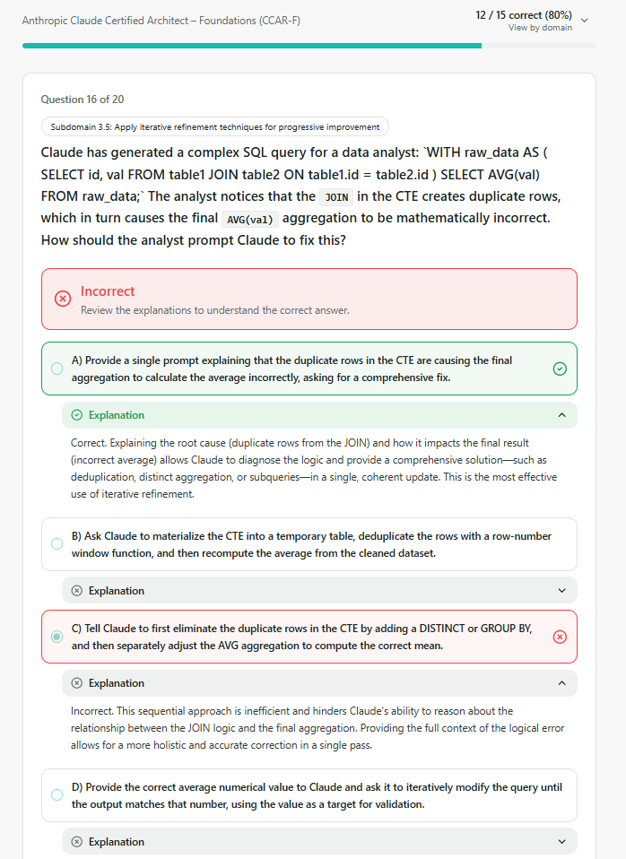
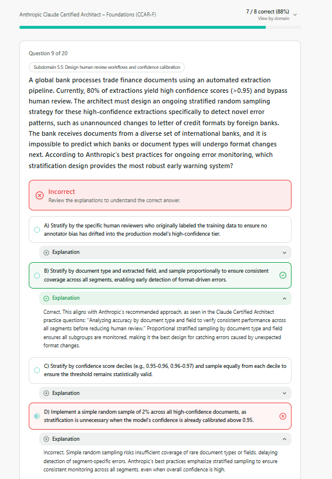
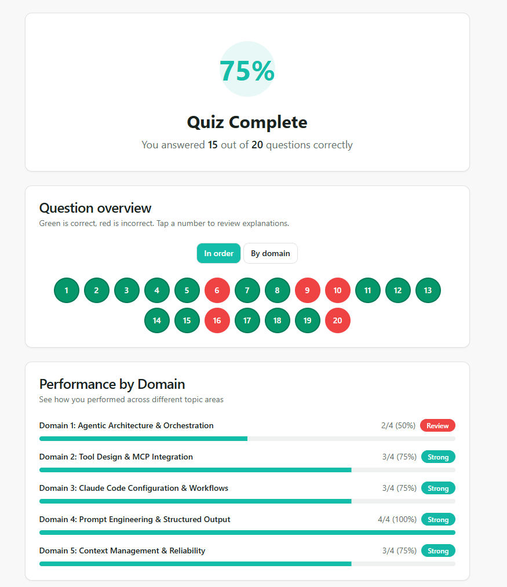

# QUESTIONS

## 1.Agentic Architecture & Orchestration (2/4)
### 1.2 Multi-Agent Orchestration
#### ⚠️Unverified 

### Inferences:

- **DAG**: Allows the coordinator to dynamically route and select the execution path based on runtime context.
- **Sequential**: Executes tasks in a strict, linear order where each job strictly depends on the output of the previous one.

---

### 1.7 Session State, Resumption & Forking

### Inferences:

- **/compact** Command: While /compact summarizes conversation history, it does not fully eliminate the risk of stale context leading to hallucinations.

- **Best Practice**: Starting a new session with a structured summary is the best practice to ensure proper context isolation.

---

## 2.Tool Design & MCP Integration (3/4)

### 2.5 Selecting Built-in Tools

### Inferences:

- Line-based approach is fraigle. (grep+replace)
- jq utility to structurally parse tje JSON.

---

## 3.Claude Code Configuration & Workflows (3/4)
### 3.5 Iterative Refinement Techniques

### Inferences:

- It was overlooked. There is no need to take notes.

---

## 4.Prompt Engineering & Structured Output (4/4)

> 🟢 **Evaluation:** 4/4 (All questions were answered correctly.)

---

## 5.Context Management & Reliability (3/4)
### 5.5 Human Review & Confidence Calibration

### Inferences:

- Simple *random* sampling risks insufficient coverage of **rare** document types of fields.

---

# RESULT

---
