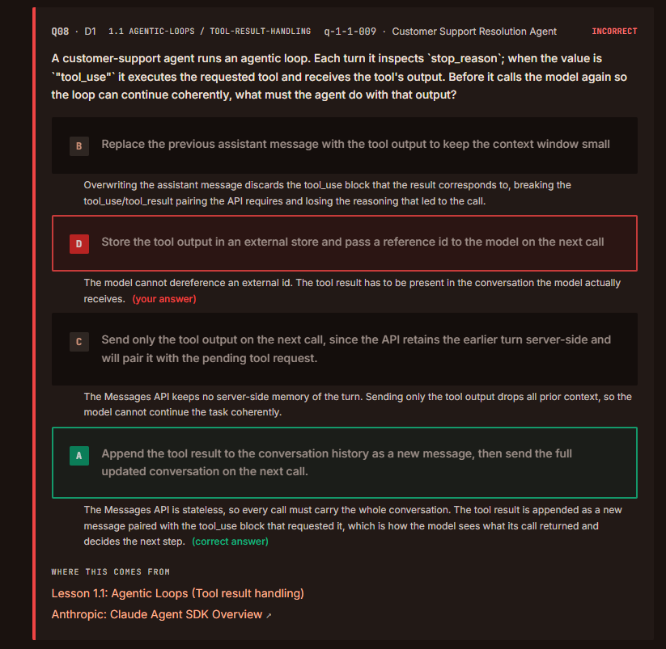
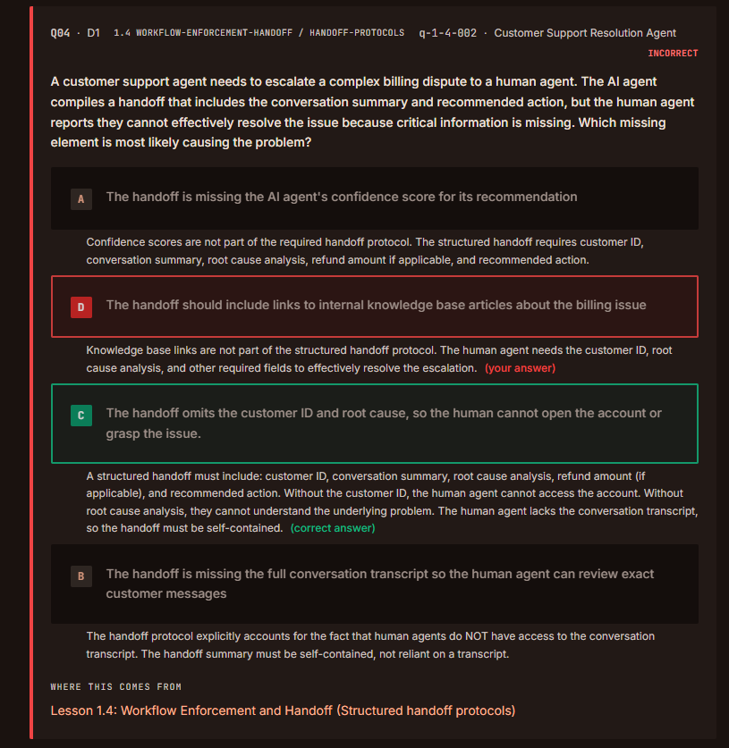
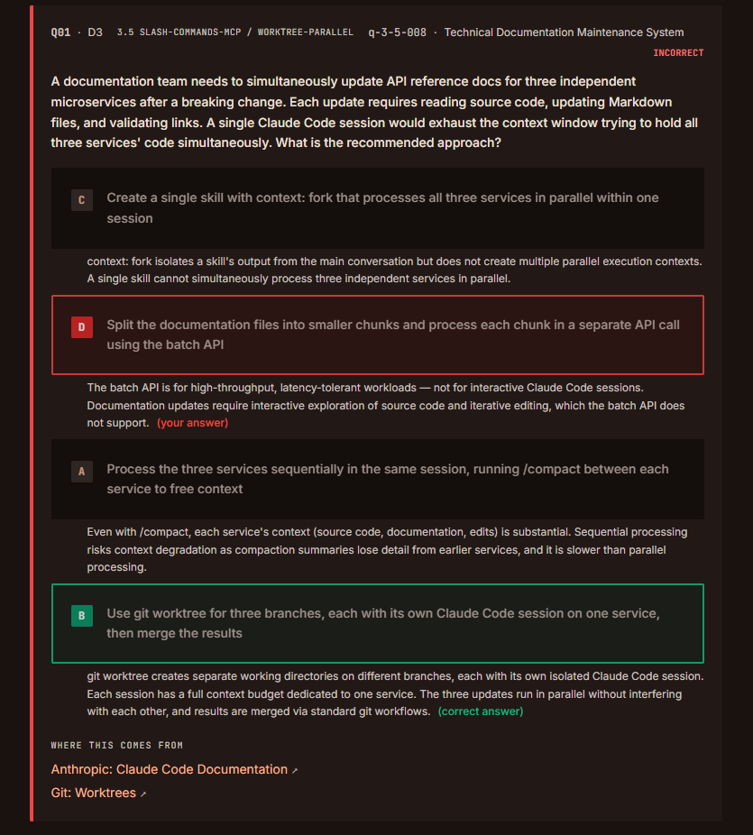
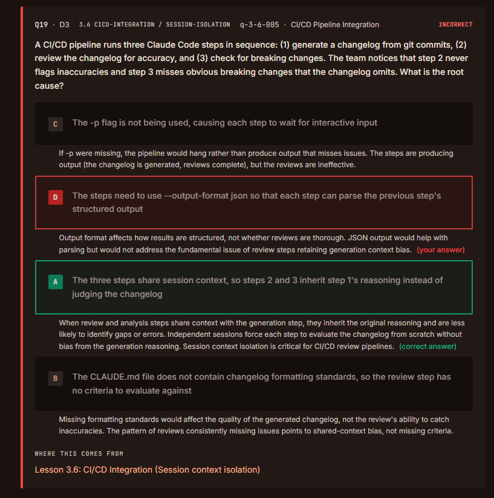
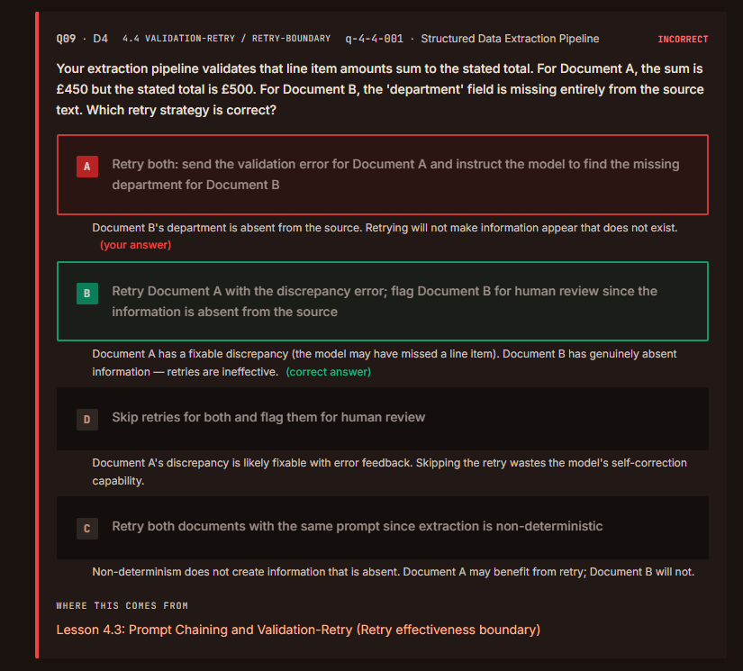
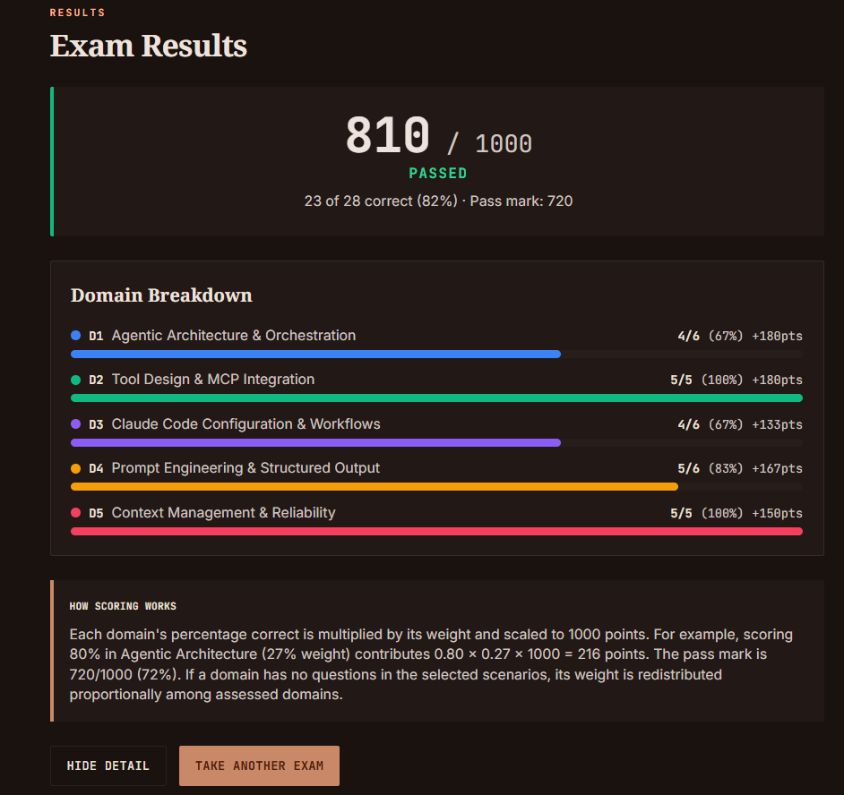

# QUESTIONS

## 1.Agentic Architecture & Orchestration (4/6)

### 1.1 Designig Agentic Loops

### Inferences:

- The **model cannot** dereference an **external id**. 
- The tool **result** has to be present in the **conversation** the model actually receives.
- The message API is **stateless**, so every call must carry the whole conversation. 

---
### 1.4 Workflow Enforcement & Handoff

### Inferences:

- Knowledgebase **links** are **not** part of the structured handoff protocol.
- The handoff must be **self contained**.
- A structured handoff must include:
    1. customer id
    2. conversation 
    3. summary 
    4. root cause analysis 
    5. refund amount 
    6. recommended action 

---

## 2.Tool Design & MCP Integration (5/5)

> 🟢 **Evaluation:** 5/5 (All questions were answered correctly.)

---

## 3.Claude Code Configuration & Workflows (4/6)

### 3.5 Iterative Refinement Techniques

### Inferences:

- It was overlooked. There is no need to take notes.

---

### 3.6 Integrating Claude Code into CI/CD

### Inferences:

- Session context **isolation** is critical for **CI/CD** review pipelines.

---

## 4.Prompt Engineering & Structured Output (5/6)

### 4.4 Validation & Retry Loops

### Inferences:

- It was overlooked. There is no need to take notes.

---

## 5.Context Management & Reliability (5/5)

> 🟢 **Evaluation:** 5/5 (All questions were answered correctly.)

---

# RESULT

---
