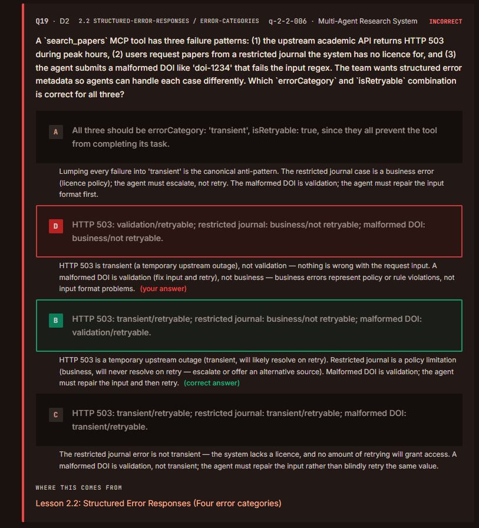
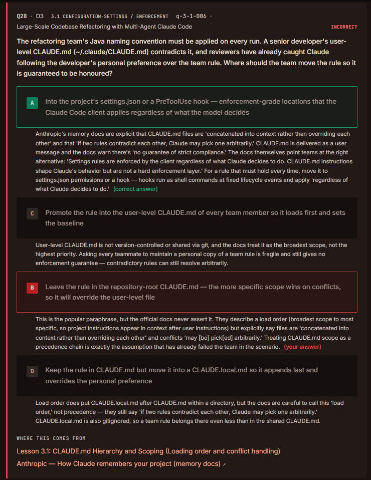
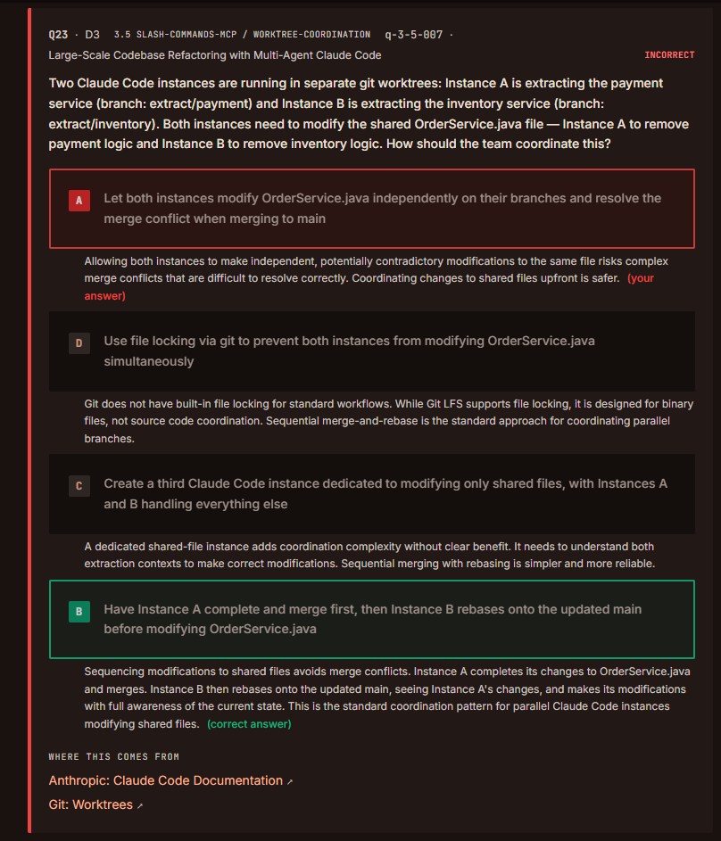
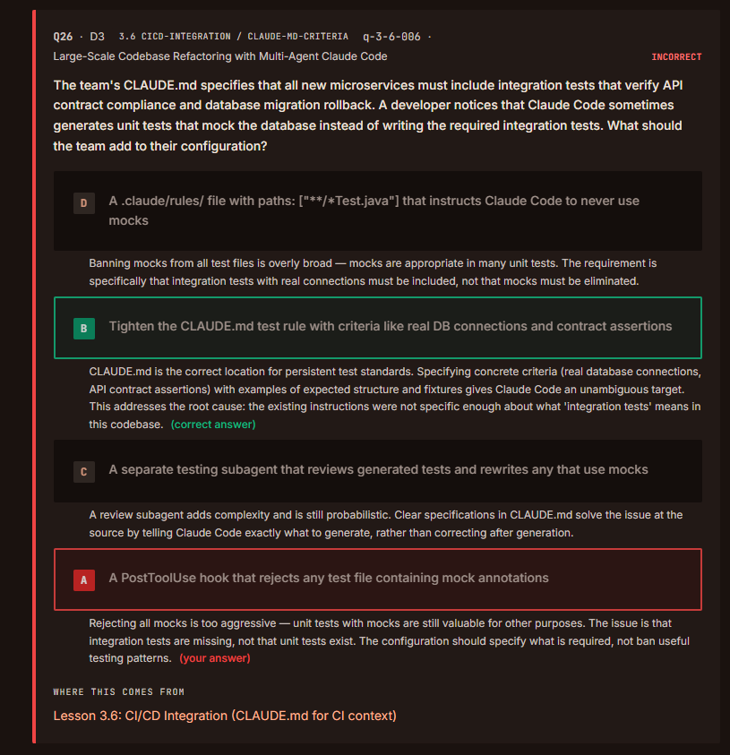
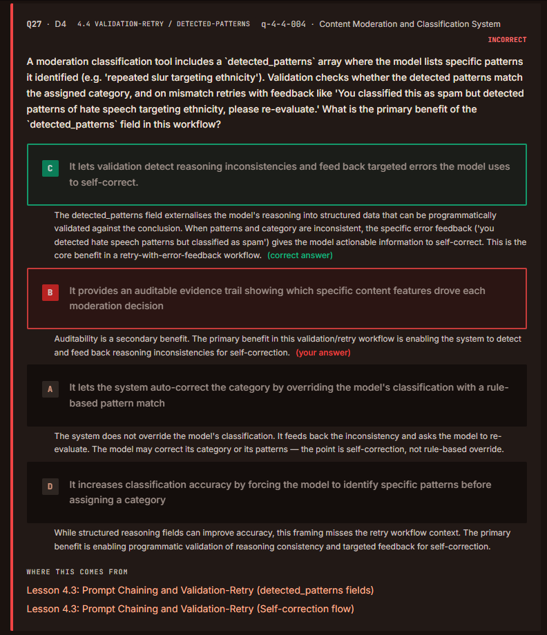
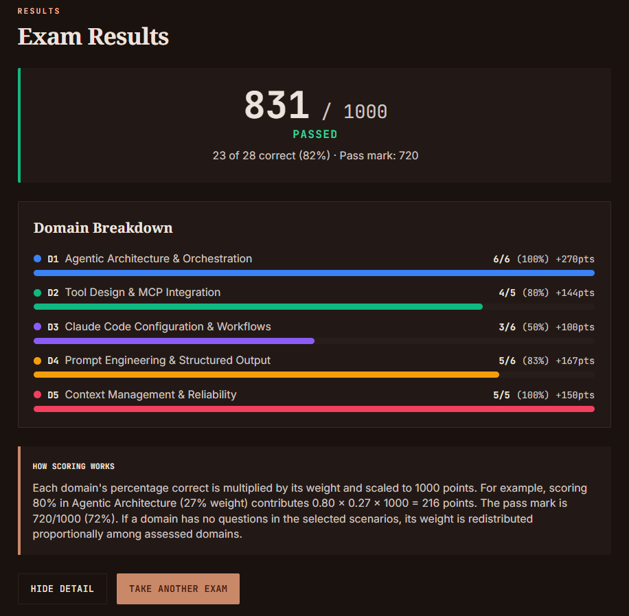

# QUESTIONS

## Agentic Architecture & Orchestration (6/6)

### 1.1 Designig Agentic Loops

> 🟢 **Evaluation:** 6/6 (All questions were answered correctly.)

---

## Tool Design & MCP Integration (4/5)

### 2.2 Designing Tool Interfaces

### Inferences:

- **Malformed** DOI: Doesn't mean the resource does not exist. It simply indicates a formatting error.

---

## Claude Code Configuration & Workflows (3/6)

### 3.1 CLAUDE.md Hierarchy & Scoping

### Inferences:

- Avoid trying to override project level to user level. Claude may select the wrong one.
- Instead, use a PreToolUse hook. It guarantees the team naming convention.

---

### 3.5 Iterative Refinement Techniques

### Inferences:

- Complex merge conflicts that are difficult to resolve correctly.
- Sequencing modifications to shared files avoids merge conflicts.
- Modifying shared files (parallel instances) standart pattern is: 
    1. Complete A
    2. B rebase A changes
    3. Complete B 

---

### 3.6 Integrating Claude Code into CI/CD

### Inferences:

- It was overlooked. There is no need to take notes.

---

## Prompt Engineering & Structured Output (5/6)

### 4.4 Validation & Retry Loops

### Inferences:

- It was overlooked. There is no need to take notes.

---

## Context Management & Reliability (5/5)

### 5.1 Managing Conversation Context

> 🟢 **Evaluation:** 5/5 (All questions were answered correctly.)

---

# RESULT

---
