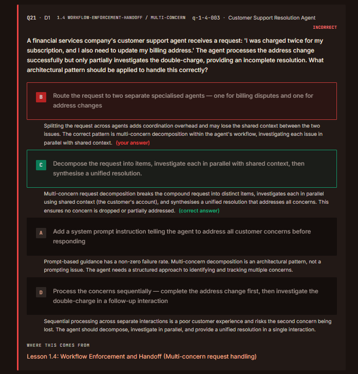
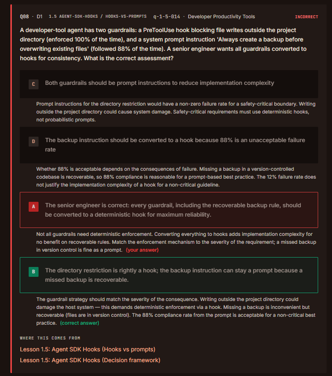
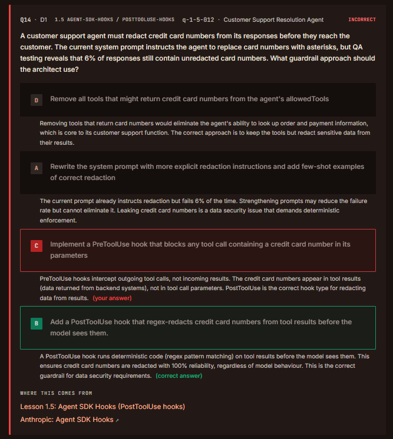
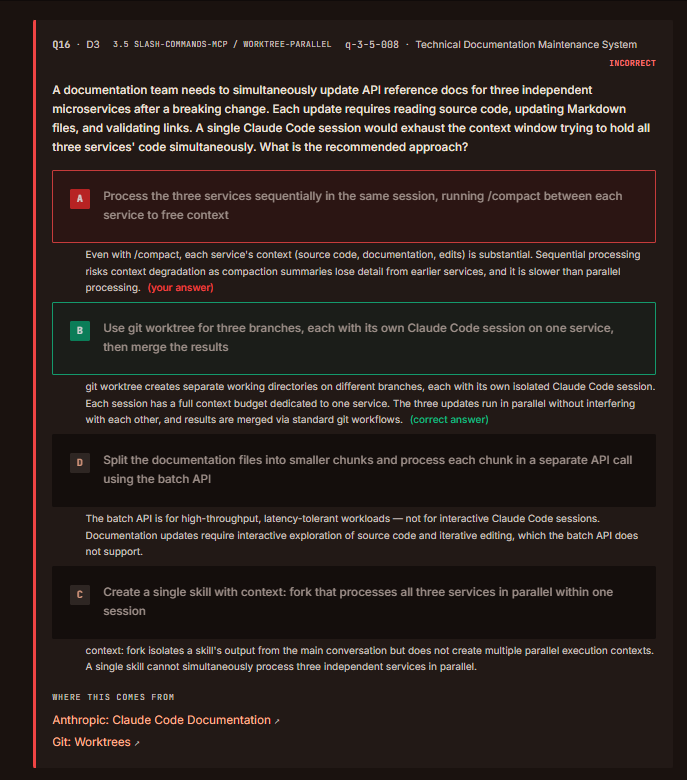
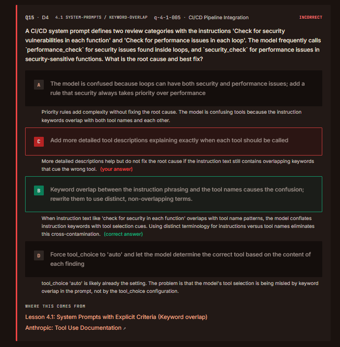
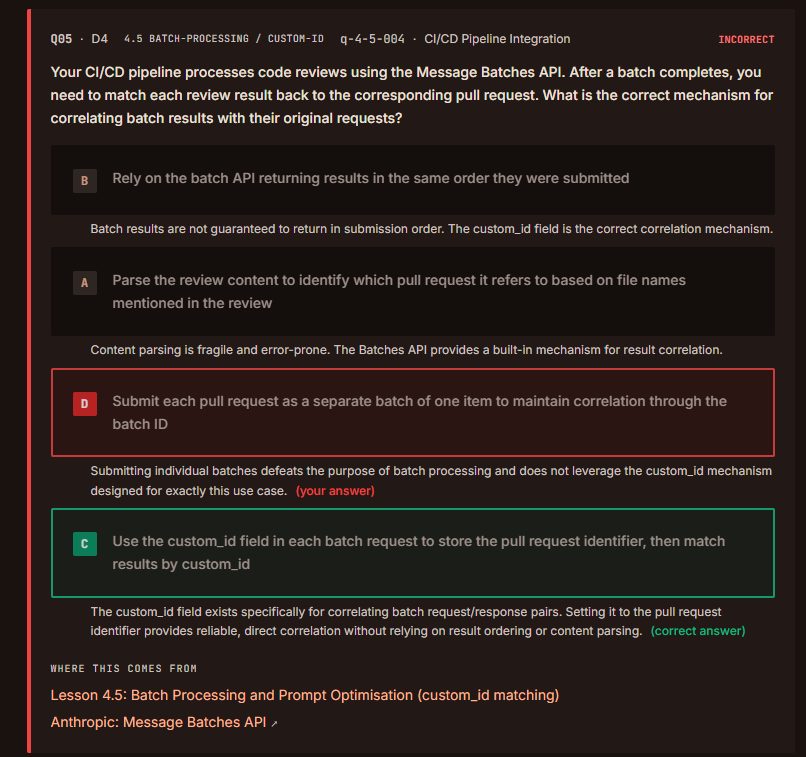
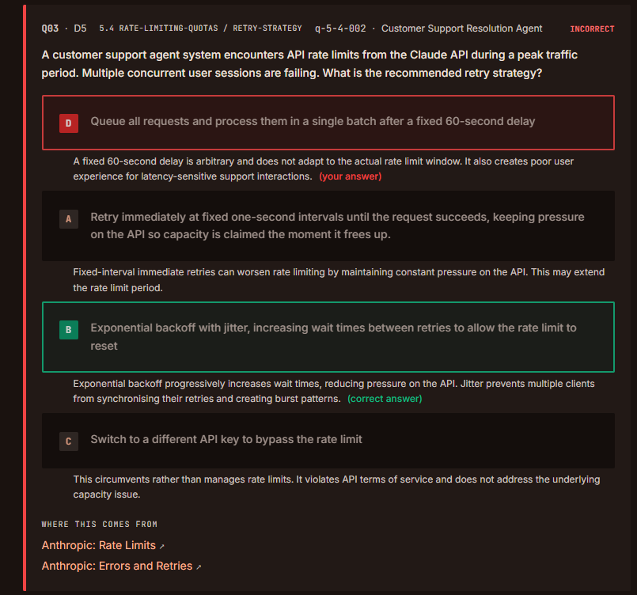
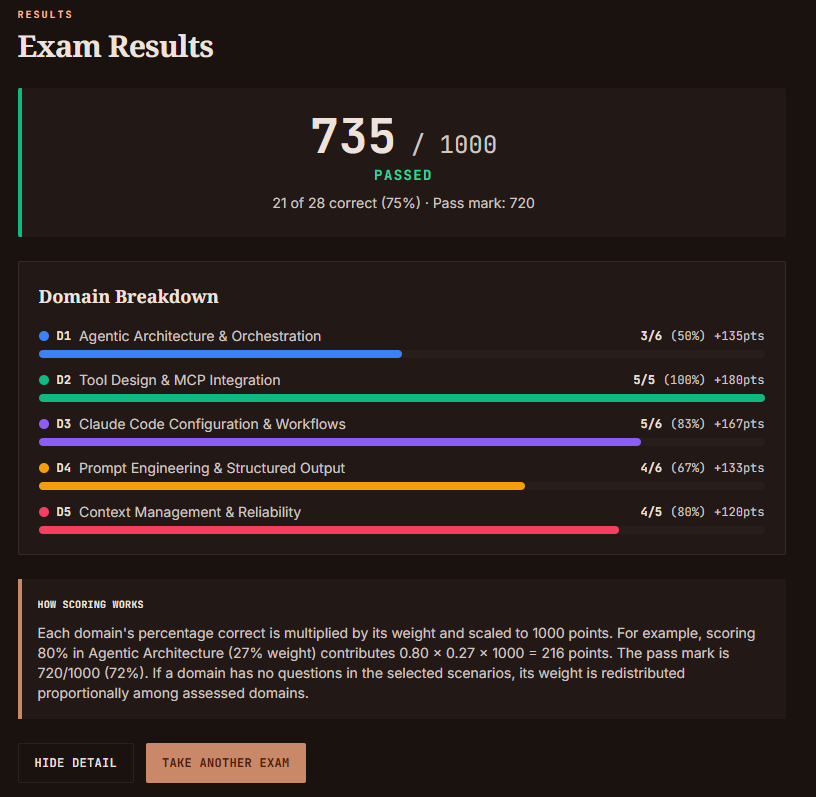

# QUESTIONS

## Agentic Architecture & Orchestration (3/6)

### 1.4 Workflow Enforcement & Handoff

### Inferences:

- Splitting the request accross agents add s *coordination overhead* and may lose the shared context between the two issues. 
- The correct pattern is multi-concern decomposition within the agent's workflow, investigate each issue in parallel with shared context.  

### 1.5 Agent SDK Hooks

### Inferences:

- **Don't** use hooks for everything. Prompt is acceptable for a *non critical* best practice.

---

### Inferences:

- **PreToolUse** hooks intercept **outgoing** tool calls, not incoming results.
- **PostToolUse** is the correct hook type for redacting data **from results**.

---

## Tool Design & MCP Integration (5/5)

> 🟢 **Evaluation:** 5/5 (All questions were answered correctly.)

---

## Claude Code Configuration & Workflows (5/6)

### 3.5 Iterative Refinement Techniques

### Inferences:

- It was overlooked. There is no need to take notes.

---

## Prompt Engineering & Structured Output (4/6)

### 4.1 Prompts with Explicit Criteria

### Inferences:

- When said "system prompt" you need fix overlap in the instruction. Descriptions are not first solution.

### 4.5 Batch Processing Strategies

### Inferences:

- The **custom_id** field exists specifically for correlating batc request/response pairs.

---

## Context Management & Reliability (4/5)

### 5.4 Context in Large Codebase Exploration

### Inferences:

- **Jitter** prevents multiple clients from synchronising their retries and creating burst patterns.

---

# RESULT

---
