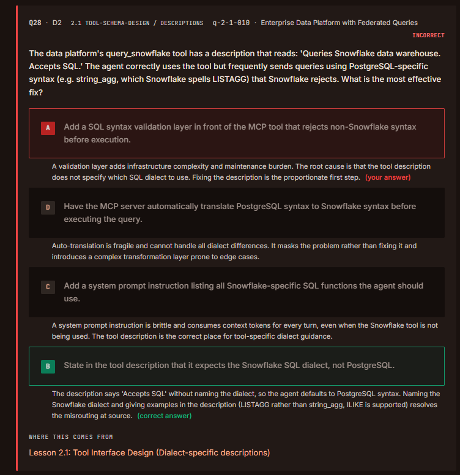
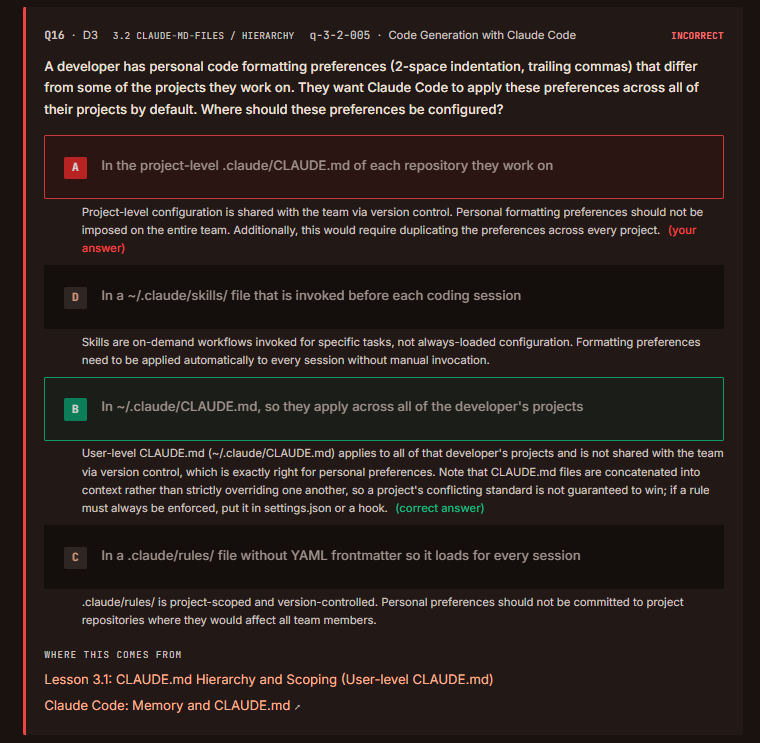
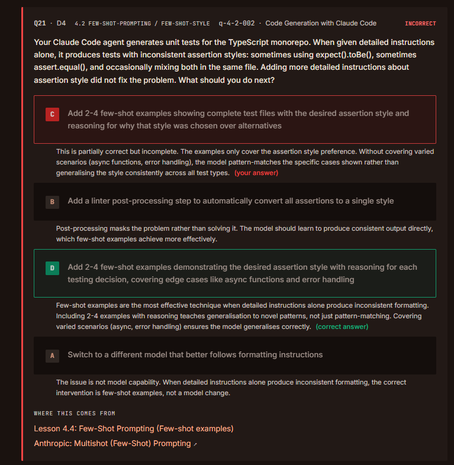
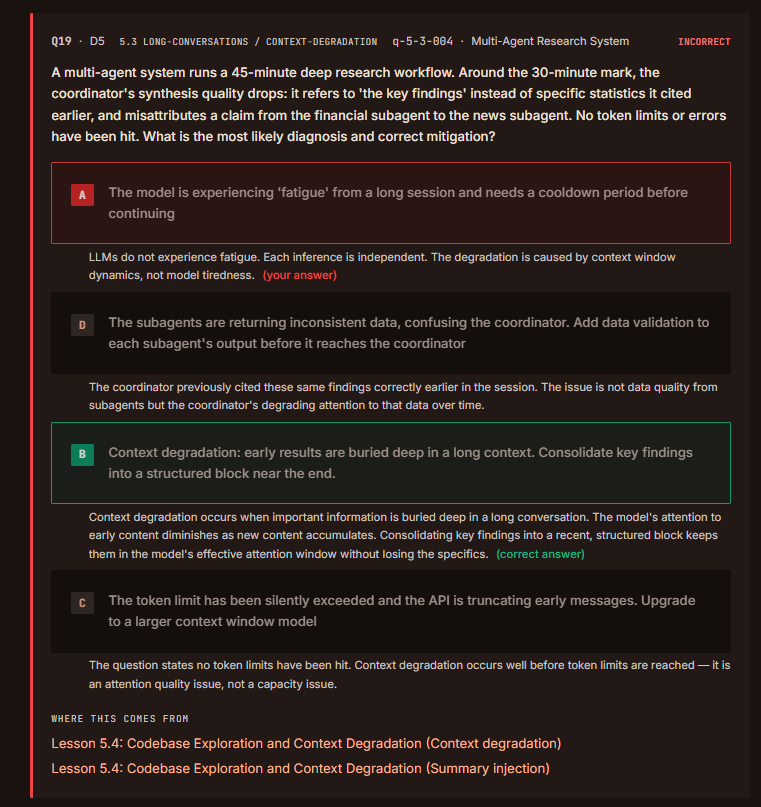
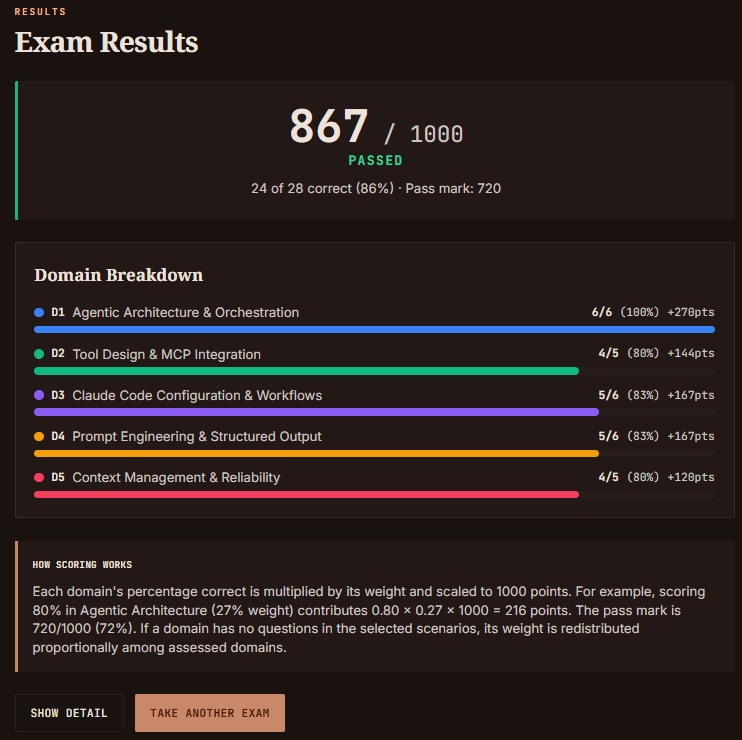

# QUESTIONS

## Agentic Architecture & Orchestration (6/6)

### 1.1 Designig Agentic Loops

> 🟢 **Evaluation:** 6/6 (All questions were answered correctly.)

---

## Tool Design & MCP Integration (4/5)

### 2.1 Designing Tool Interfaces

### Inferences:

- Adding a new layer is often a trap.

---

## Claude Code Configuration & Workflows (5/6)

### 3.2 Custom Slash Commands & Skills

### Inferences:

- Wording trap. They(!?), really 😁

---

## Prompt Engineering & Structured Output (5/6)

### 4.2 Few-Shot Prompting

### Inferences:

- Covering varied scenarios ensures the model generalies correctly. 

---

## Context Management & Reliability (4/5)

### 5.3 Error Propagation in Multi-Agent Systems

### Inferences:

- It was overlooked. There is no need to take notes.

---

# RESULT

---
