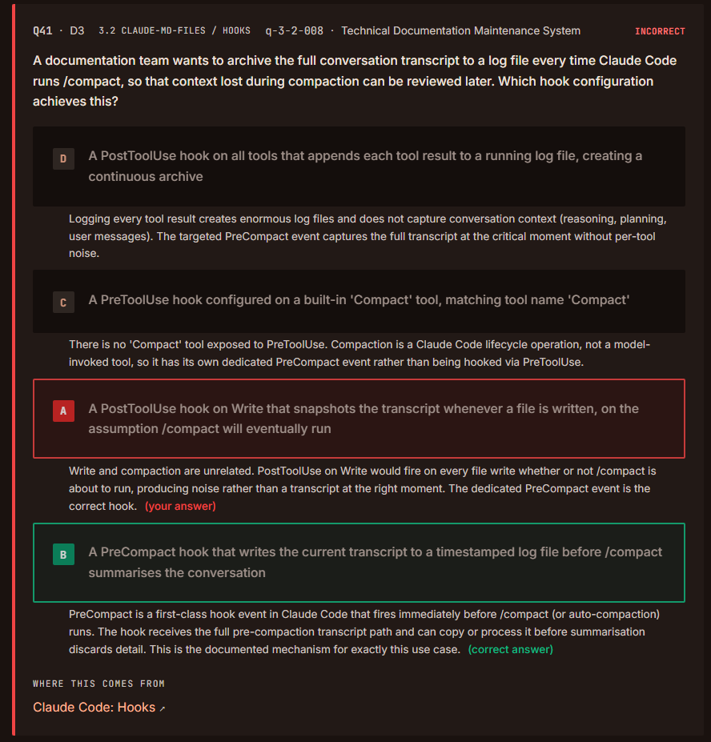
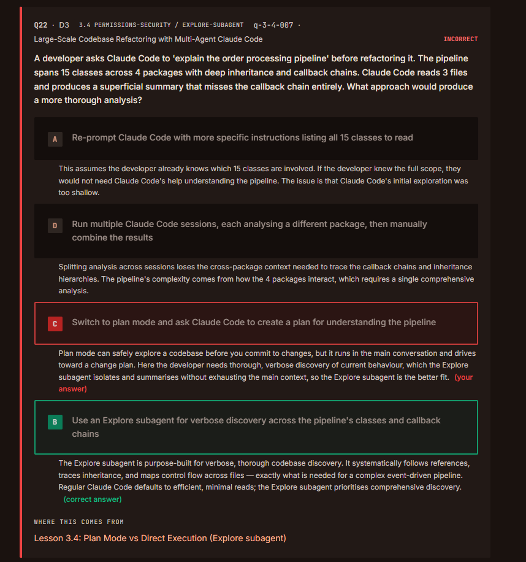
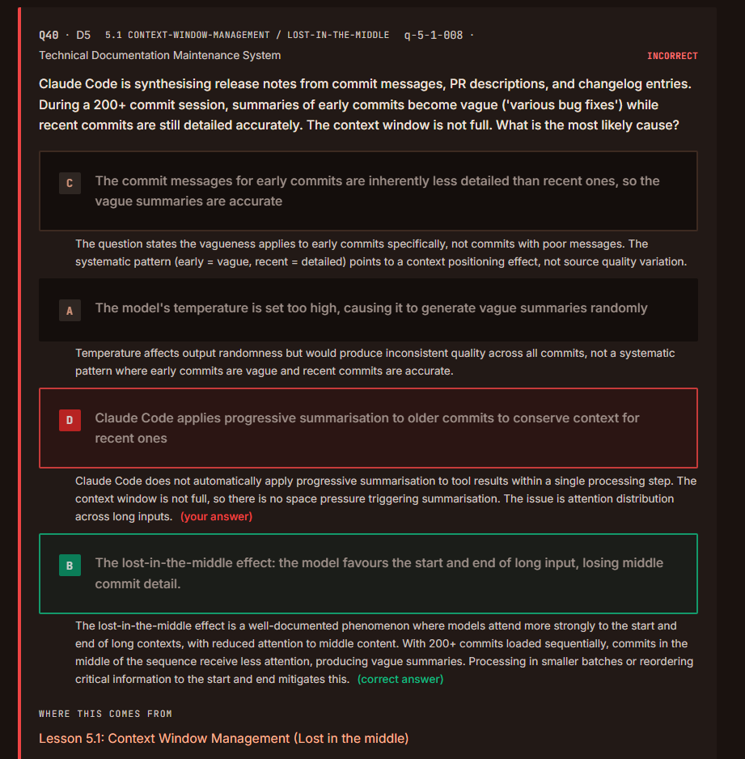
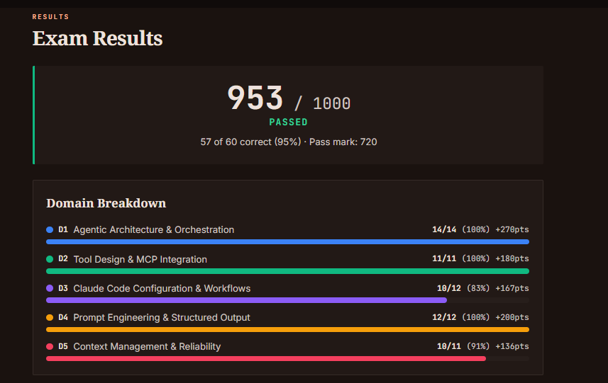

# QUESTIONS

## Agentic Architecture & Orchestration (14/14)

> 🟢 **Evaluation:** 14/14 (All questions were answered correctly.)

---

## Tool Design & MCP Integration (11/11)

> 🟢 **Evaluation:** 11/11 (All questions were answered correctly.)

---

## Claude Code Configuration & Workflows (10/12)
### 3.2 Custom Slash Commands & Skills

### Inferences:

- **PreCompact**: The hook receives the full pre-compaction transcript path and can copy or process it before summarisation discards detail.  

---

### 3.4 Plan Mode vs Direct Execution

### Inferences:

- Plan mode runs in the main conversation and drives toward a change plan.
- Explore subagent is purpose-built for verbose.

---

## Prompt Engineering & Structured Output (12/12)

> 🟢 **Evaluation:** 5/5 (All questions were answered correctly.)

---

## Context Management & Reliability (10/11)

### 5.1 Managing Conversation Context

### Inferences:

- Claude Code does not automatically apply progressive summarisation to tool results within a single processing step.
- The *lost-in-the-middle effect* does not always appear in a perfect **U** shape.

---

# RESULT

---
