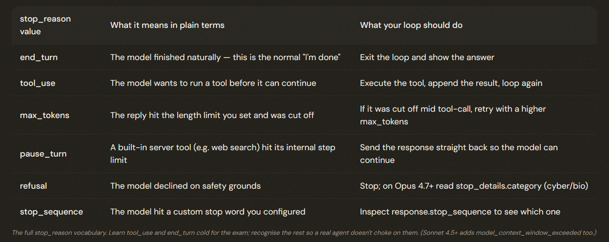

# 1.1 Designing Agentic Loops

## Agentic Loops

---

## Four Step Lifecycle

---

## Stop Reason Table

---

- ❌ **Reading the model's words to decide it's done.** Checking whether the reply contains "I'm finished." 
- ✅ Check `stop_reason` — language is ambiguous ("finished the first file" ≠ finished everything), which is the exact problem `stop_reason` was created to solve.
---
- ❌ **Using an iteration cap as the main stop.** "Stop after 10 loops" as the primary rule. This either cuts off a task that needed 12 steps or wastes turns on one that finished in 3. 
- ✅ Stop on `end_turn`; keep a cap (say 20) only as a safety net so a buggy agent can't run forever.
---
- ❌ **Checking the content type.** Deciding you're done because `response.content[0].type == "text"`. 
- ✅ Use `stop_reason` — the model can return explanatory text AND a `tool_use` request in the very same response, so seeing text first means nothing.
---
- ❌ **Forcing the model to always call a tool.** Setting `tool_choice: "any"` to stop it from replying in text. 
- ✅ Don't — if the model is forced to call a tool every turn, it can never reach `end_turn`, and you've built an agent that literally cannot stop.

---

> ⚠️ **1.1.6 — Exam Trap**
>
> When a question describes an agent that stops early, runs forever, or behaves erratically on a multi-tool task, scan the answers for the one that switches control to `stop_reason` — that is almost always correct. Answers that 'strengthen the prompt', 'add a cap', 'check the text', or 'force tool_choice:any' are the distractors.

## Stop Reason Signals

