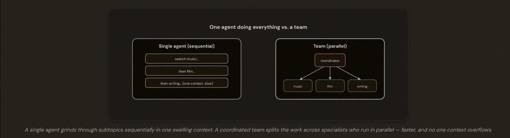
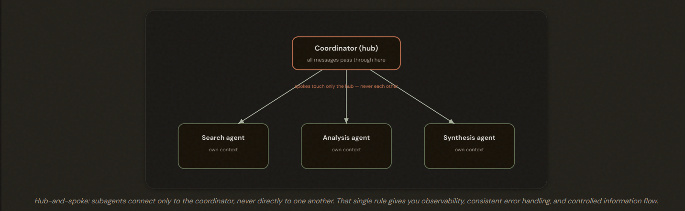
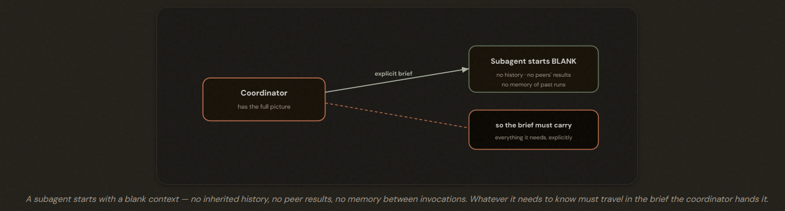
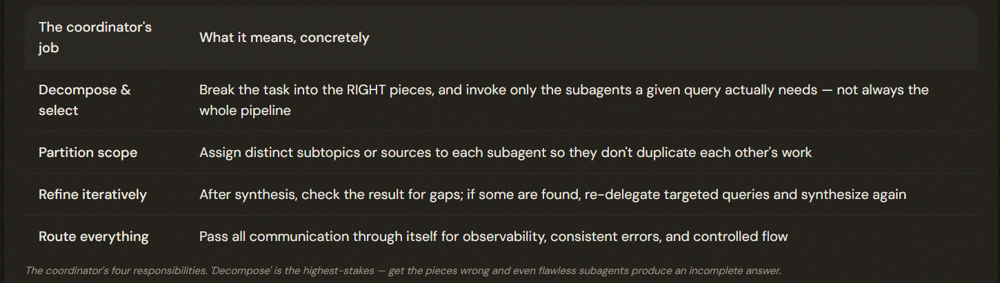
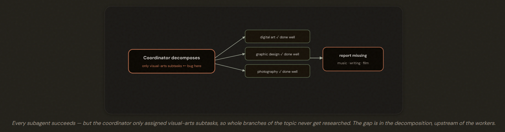
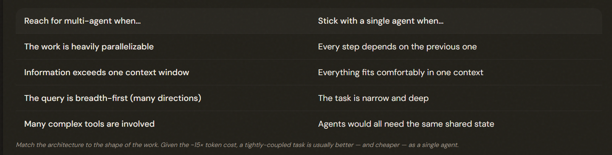

# 1.2 Multi-Agent Orchestration

## When One Agent Isn't Enough

---

## Hub & Spoke

### Advantages:
 - Observability: The coordinator sees everything that happens, so you can debug it
 - Consistent Error Handling: One place decides what to do when something fails
 - Controlled Information Flow: The coordinator decides exactly what each subagent sees, so nothing leaks or gets duplicated by accident

---

## The Isolation Principle — Subagents Start Blank

---

## The Coordinator's Four Jobs

---

## The Signature Failure: Blame the Decomposition, Not the Workers

---

> ⚠️ **1.2.5 — Exam Trap**
>
> ✅ Fix the coordinator's decomposition so **it covers all relevant domains of the topic**. Read the decomposition logs first.
>
> ❌ Blaming the search/analysis/synthesis agent for a coverage gap they were never assigned to fill.
>
> ❌ Adding more subagents, expanding search queries, or bolting on a gap-detector.

## The Price Tag — and When It's Worth Paying

---