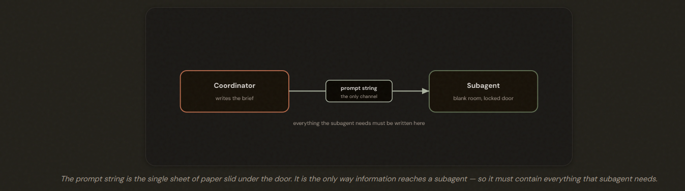
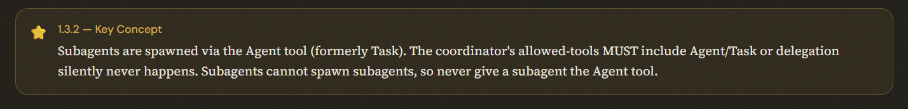
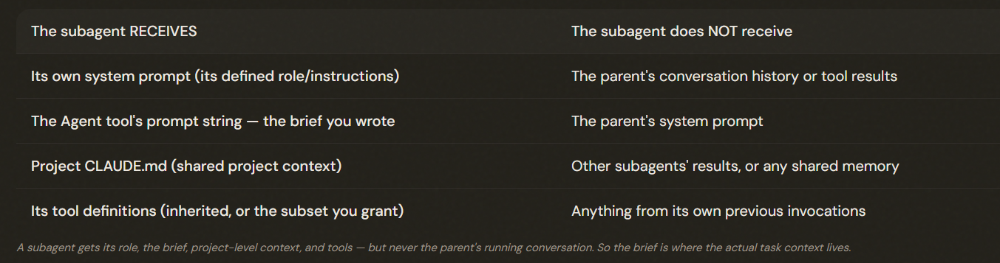
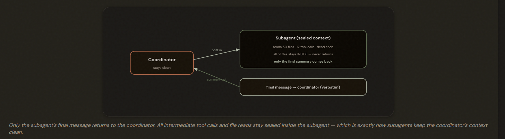
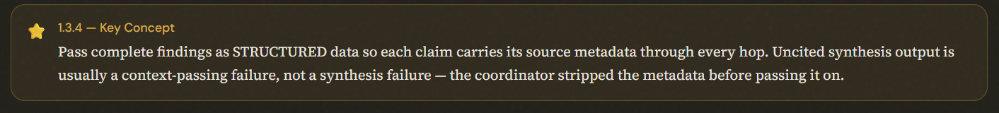
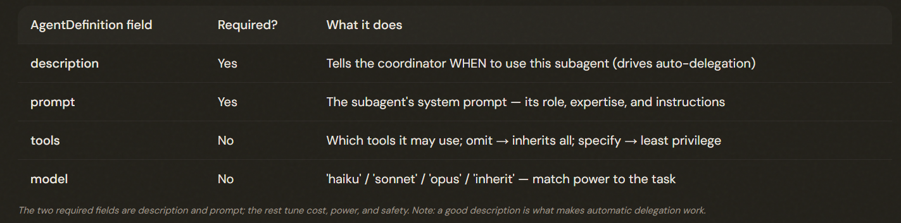
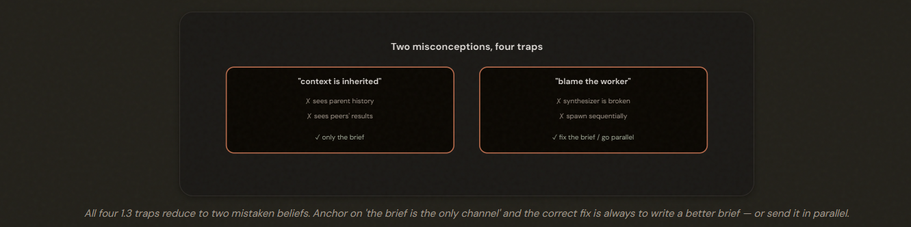

# 1.3 Subagent Invocation & Context Passing

## The Problem: A Worker Who Remembers Nothing

---

## How You Spawn a Subagent: the Agent Tool
1. There's one gate you must not forget: for a coordinator to use the Agent tool, its list of allowed tools must INCLUDE the Agent (or Task) tool. This is a simple on/off switch. Leave it out and the coordinator literally cannot spawn anyone — and the frustrating part is it fails silently: the coordinator just does the work itself or gives up, with no error telling you the door was locked. If a coordinator mysteriously refuses to delegate, this is the first thing to check.

2. One more rule that surprises people: a subagent cannot spawn its own subagents. The hierarchy is exactly one level deep — coordinator at the top, workers below, full stop. So you never put the Agent tool in a subagent's own tool list. This is a deliberate guard against runaway nesting where agents spawn agents spawn agents.

---

## What Crosses the Boundary — and What Doesn't

---

## Writing a Brief That Keeps Citations Alive
The problem: Context-passing bug.
Preventing with three rules:
1. Pass **COMPLETE** prior findings into the brief. Don't make the subagent re-derive what an earlier stage already found. 
2. Use **STRUCTURED** data that keeps content and its metadata together, so the source travels alongside every claim through every hop.
3. Write the brief around the **GOAL** and quality bar, not a rigid step-by-step procedure. That preserves the subagent's ability to adapt while still constraining the outcome.

---

## Spawning in Parallel and the AgentDefinition
1. **Parallelism**: If the coordinator emits SEVERAL Agent tool calls in a single response, those subagents run at the same time. If instead it spawns one, waits, then spawns the next on a later turn, they run sequentially and you lose the whole benefit. So for independent work, fire all the delegations in one response.

2. **DEFINE**: 
    - Description: A plain-language note on WHEN to use this subagent, which is what lets the coordinator auto-decide to delegate to it
    - Prompt: It's system prompt. It's role and instructions. 
    - Everything else is optional but useful: tools, model, and more. 

---

## The Exam Traps

---

- ❌ **Assuming inheritance.** Believing a subagent can see the parent's history or another subagent's results.
- ✅  It can't — only what's in its brief; pass everything explicitly.
---
- ❌ **Blaming the synthesizer.** Concluding the synthesis agent is broken when its report lacks citations. 
- ✅ The coordinator stripped the source metadata in transit — fix the context passing, not the synthesizer.
---
- ❌ **Spawning sequentially.** Delegating independent tasks across separate turns, one at a time. 
- ✅ Emit multiple Agent calls in one response so they run in parallel.
---
- ❌ **Over-specifying the brief.** Writing a rigid step-by-step procedure that kills the subagent's adaptability.
- ✅ Specify the goal and quality criteria; let the subagent choose how.

---

---

> ⚠️ **1.3.6 — Exam Trap**
>
> When a downstream subagent's output is missing something (citations, context, a fact), the cause is almost always what the coordinator did or didn't put in the brief — not the subagent. The fix is structured, complete context passing, never 'give the downstream agent more tools' or 'use a bigger model.'