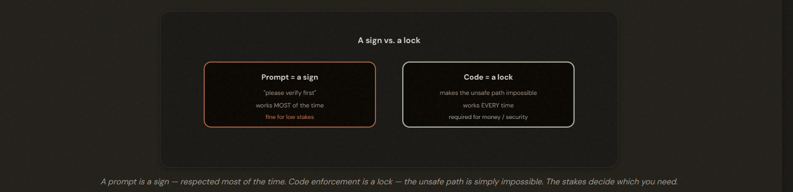
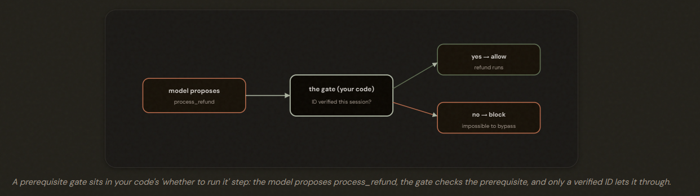
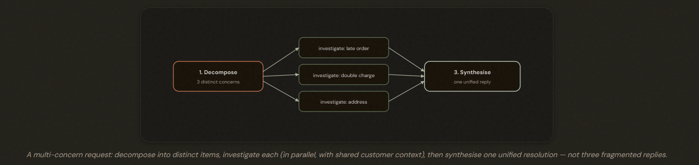
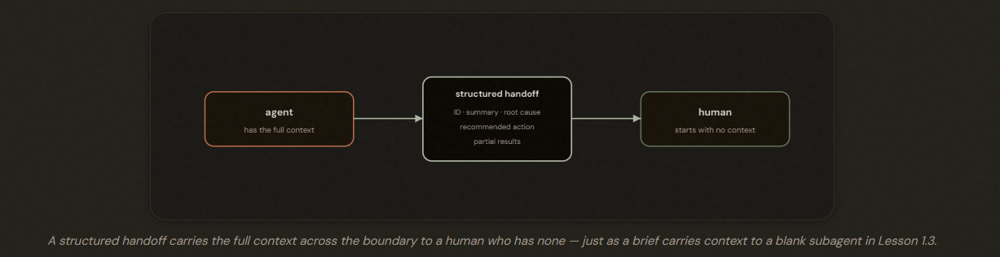
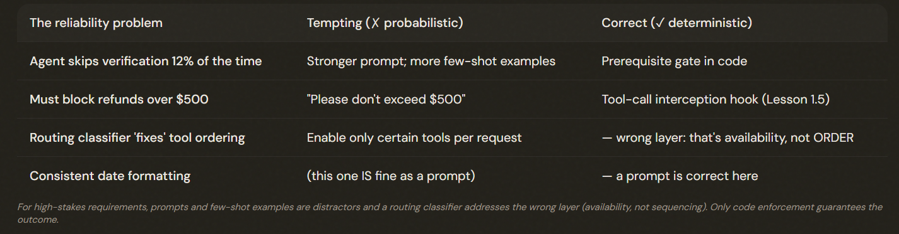

# Workflow Enforcement & Handoff

## The Question Behind Half the Exam

- Prompt-based guidance is probabilistic: A sign — works most of the time.
- Programmatic enforcement is deterministic: A lock — works every time.

---

## The Enforcement Spectrum

---

## The Prerequisite Gate — Building the Lock

You can prompt the model however you like; the **lock is in the code**, not the conversation.

---

## Handling Requests With Several Problems at Once

For a request bundling several concerns, decompose it into distinct items, investigate each in parallel using shared context, then synthesise a single unified resolution. Rather than handling one and dropping the rest.

--- 

## The Structured Handoff to a Human

The problem: The human who takes over has NONE of the context.

Solution:
- Customer ID and the verified account in question — so the human isn't re-identifying anyone.
- A concise summary of what the customer asked and what's already been tried.
- The root-cause analysis — what the agent determined is actually wrong.
- The concrete recommended action (e.g. a specific refund amount or the policy exception requested).
- Any partial results already gathered, so the human continues rather than restarts.

Note: A human handoff transfers a problem to someone with no prior context, so design it like a subagent brief: self-contained and structured investigating.

--- 

## The Exam Traps

---

> ⚠️ **1.4.6 — Exam Trap**
>
> When a question describes a financial/compliance reliability failure (e.g. 'the agent skips verification X% of the time'), reject 'enhance the prompt', 'add few-shot examples', and 'add a routing classifier' (which addresses availability, not ordering). Choose the programmatic prerequisite gate — the only deterministic guarantee.