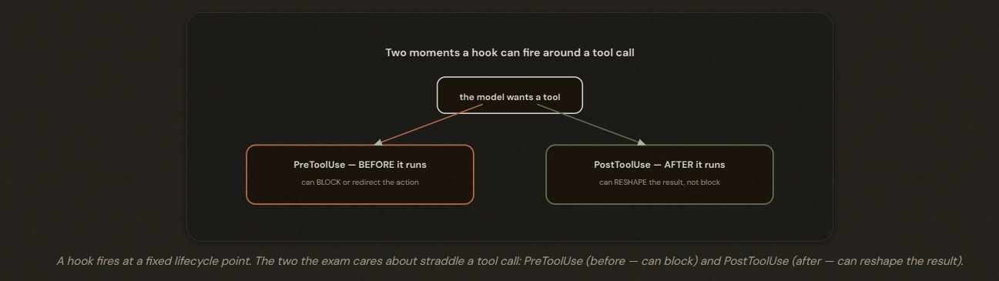
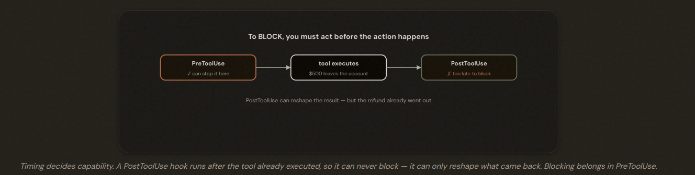
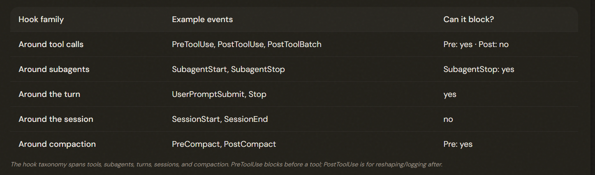
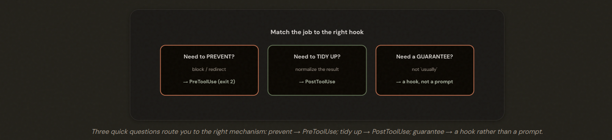

# 1.5 Agent SDK Hooks

## Code That Runs at Exactly the Right Moment

A hook is your code that Claude runs automatically at a fixed point in the lifecycle. Because it fires every time, it's deterministic. The two key moments are just before a tool runs and just after.

---

## Timing Is Everything: Before vs After

- PreToolUse hook: **PREVENT**. Only one chance to stop it. Block-Redirect. 
- PostToolUse hook: **TIDY UP**. Reshape the result before the model sees it. Reshape.

---

## PostToolUse: Making Messy Data Tidy

**DETERMINISTIC**

PostToolUse hooks normalize heterogeneous tool results (Unix→ISO-8601, status codes→words, currency formatting) before the model sees them. Because it's a deterministic transform, it belongs in a hook — never in the prompt, which is probabilistic and wastes tokens.

---

## PreToolUse: Enforcing the Rules

PreToolUse hooks enforce rules by blocking or redirecting actions before they run. A hook signals its decision via exit codes (exit 2 blocks; exit 0 allows; exit 1 does NOT block) OR via JSON on exit 0 — choose one mechanism, not both.

How does a hook communicate its decision back to Claude? ⚠️ *Pick ONE, Not Both!*
- Exit codes-> exit 0 means 'fine, carry on'; exit 2 means 'BLOCK this.' etc. 
- Exit 0 and print a small JSON object(RICHER CONTROL) -> {"decision":"block","reason":"…"} 

⚠️ **Note**: *For hooks, exit 0 = success, exit 2 = block, and any other non-zero (including 1) is a non-blocking error*

---

## The Bigger Picture: a Lifecycle Full of Hooks

Beyond Pre/PostToolUse, hooks span subagent, per-turn, session, and compaction events. Subagent-scoped hooks fire only while that subagent is active, and a Stop hook attached to a subagent auto-converts to SubagentStop.

---

## The Exam Traps

---

- ❌ **Blocking in the wrong place.** ✗ Using a PostToolUse hook to block an action.
- ✅  It can't — only what's in its brief; pass everything explicitly.
---
- ❌ **Prompting where a hook is needed.** Relying on a system-prompt instruction for a 100%-compliance requirement.
- ✅ Use a hook — prompts are probabilistic.
---
- ❌ **Transforming in the model instead of in code.** Asking the model to convert every timestamp to ISO-8601.
- ✅ Do it deterministically in a PostToolUse hook.
---
- ❌ **Wrong exit code.** Returning exit 1 expecting it to block.
- ✅  Only exit 2 blocks; exit 1 is a non-blocking error.

---

---

> ⚠️ **1.5.6 — Exam Trap**
>
> Reject any answer that blocks in PostToolUse (too late), relies on a prompt for a 100% guarantee (probabilistic), normalizes data in the model instead of a PostToolUse hook, or uses exit 1 to block (only exit 2 blocks). Block in PreToolUse; normalize in PostToolUse; choose hooks when the guarantee must be absolute.