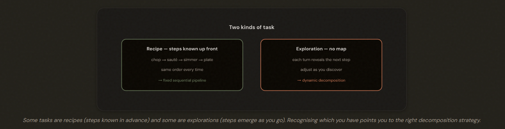
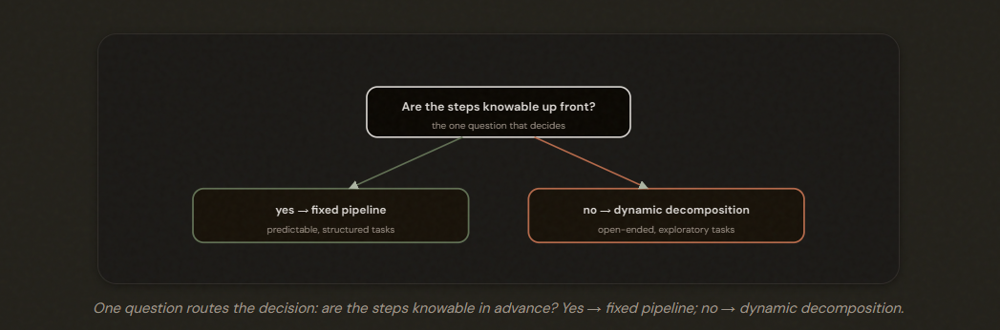
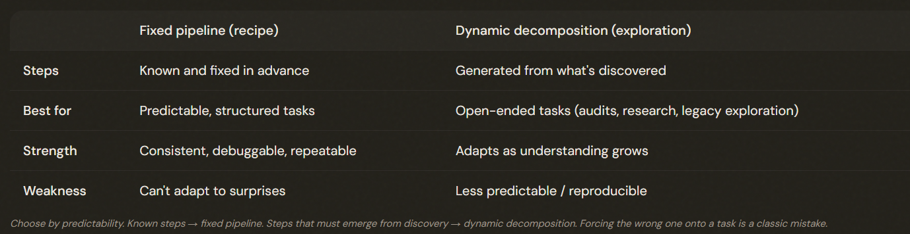
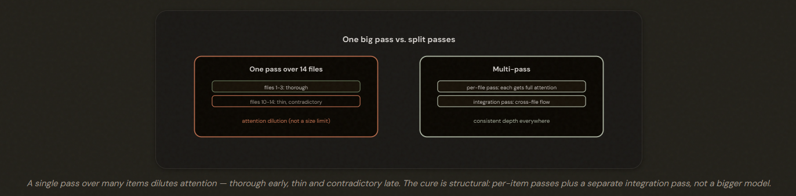
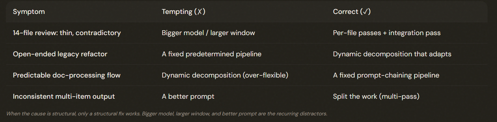

# 1.6 Task Decomposition Strategies

## Breaking Big Jobs Into Pieces

How you break a task into steps is a design choice. Recipe-like tasks (steps known up front) want a fixed pipeline; exploration-like tasks (steps emerge from discoveries) want dynamic decomposition. And beware attention dilution when one pass handles too many items.

---

## Strategy One: Fixed Sequential Pipelines

A fixed sequential pipeline (prompt chaining) uses predetermined steps in a set order. It's the right choice for predictable, structured tasks — consistent, debuggable, repeatable — but it can't adapt when something **UNEXPECTED** surfaces.

*Each step feeding the next*

Example: extract the text → classify the document → pull out the key fields → validate
**Same steps, same order, every time.**

---

## Strategy Two: Dynamic Adaptive Decomposition

Dynamic adaptive decomposition generates subtasks from intermediate findings — the right choice for open-ended work where steps can't be known in advance.

- Recipe -> Fixed Pipeline
- Exploration → Dynamic Decomposition

---

---

## The Trap of Doing Too Much at Once

Attention dilution = inconsistent, degrading quality when one pass handles many items. The cause is finite attention, **NOT context size** — so a bigger model or window does NOT fix it. The cure is multi-pass: **per-item passes plus a separate cross-item integration pass.**

---

## The Exam Traps

---

- ❌ Upgrading the model or enlarging the context window to fix inconsistent multi-item work (it's attention dilution, not capacity). 
- ❌ Assuming a better prompt equals a multi-pass split. 
- ❌ Forcing a fixed pipeline onto open-ended work, or dynamic decomposition onto a predictable flow. 
- ✅ Split into per-item + integration passes; match strategy to predictability.

---

---