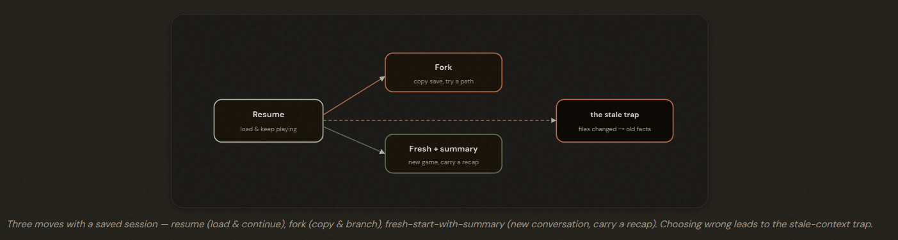
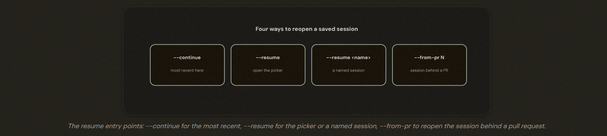
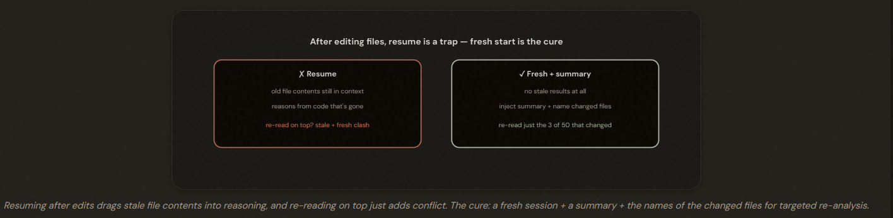
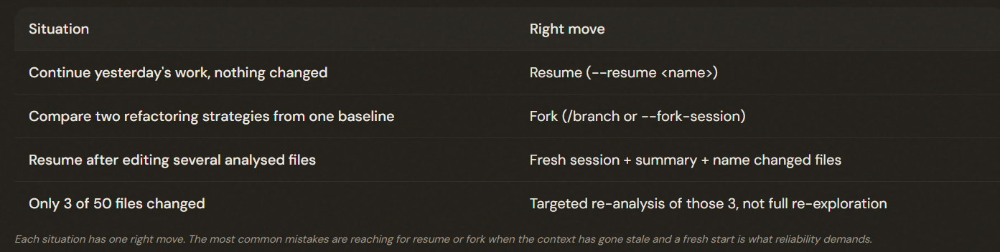

# Session State, Resumption & Forking

## Work That Spans More Than One Sitting

Three options:
1. Resume: Continue a conversation right where it stopped. (*LOAD*)
2. Fork: Branch a copy to try a different direction while keeping the original. (*COPY*)
3. Fresh start with summary: Begin a brand-new conversation but hand it a written summary of where things stand. (*START*)

---

## Resume: Loading Your Save

Resume (--continue / --resume <name> / --from-pr) reopens a saved conversation with its full history intact. It's the right move when the prior context is still valid — when **NOTHING important has changed** since you left.

---

## Fork: Branching to Explore Two Paths

Fork (/branch or --fork-session) copies the conversation so far into an independent branch, leaving the original intact — for exploring divergent approaches from a shared baseline. It is **NOT a fix for stale context**: a fork inherits the same stale facts the original had.

---

## The Stale-Context Trap

⚠️ *Files Changed Case*
- RESUME PROBLEM: You haven't removed the bad information; you've just added good information next to it.

After files change, resuming makes the agent reason from stale cached results — and re-reading on top is insufficient because the stale results still conflict. The cure: a fresh session + a structured summary + naming the changed files, re-reading only what changed (targeted re-analysis).

⚠️ **Note**: If only 3 of the 50 files changed, you re-read just those 3, not the whole codebase again

---

## The Exam Traps

---

- ❌ Using --resume after code edits and trusting the cached results.
- ❌ Using fork to escape stale context (the fork inherits it).
- ❌ Re-exploring all files when only a few changed. 
- ❌ Confusing fork (divergent exploration) with resume (continuation).
- ✅ Fresh session + structured summary + named changed files for targeted re-analysis.

---

---