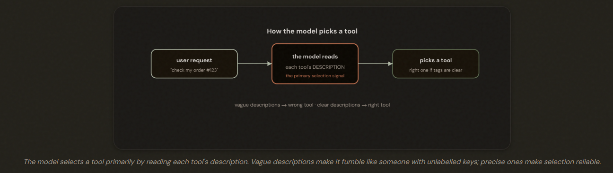
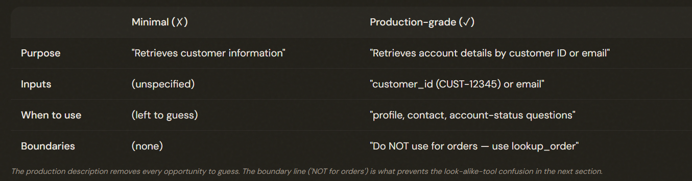
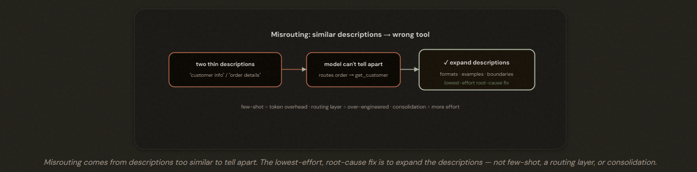
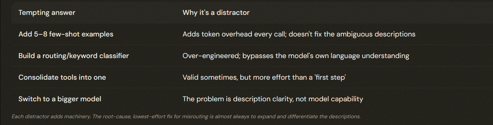

# 2.1 Designing Tool Interfaces

## Why the Description Is the Whole Game

Tool descriptions are the **PRIMARY mechanism** the model uses to select a tool. Designing a good tool is mostly about writing a description clear enough that the model never has to guess.

---

## What Separates a Minimal Description From a Production One

A production-grade tool description states its purpose, input expectations, example queries, edge cases, and — crucially — explicit boundaries versus similar tools. **The 'use this NOT that' boundary is the most valuable** line when tools could be confused.

*THE BEST PRACTICES*:
1. Primary purpose — what the tool does, in one clear sentence.
2. Input expectations — types, formats, constraints, and which inputs are required vs optional (e.g. 'customer_id in the form CUST-12345').
3. Example queries — the kinds of requests that should route here, in the words a user would actually use.
4. Edge cases and limitations — what it can't do, so the model doesn't over-reach.
5. Explicit boundaries vs similar tools — 'use this NOT that' — the single highest-leverage line when you have look-alike tools.

---

---

## The Misrouting Problem — and the Lowest-Effort Fix

When similar tools misroute, the root cause is inadequate descriptions and the most effective first step is to **EXPAND** them (formats, examples, edge cases, boundaries). Few-shot adds overhead, a routing layer over-engineers, and consolidation is more effort than a first step warrants.

---

## Splitting, Renaming, and the System-Prompt Catch

Two reshaping techniques help:
1. SPLITTING: A vague catch-all like analyze_document is hard to route to because it does many things; split it into purpose-specific tools — extract_data_points, summarize_content, verify_claim_against_source — each with a crisp input/output contract the model can match precisely. 

2. RENAMING: A tool called analyze_content that only handles web results is misleadingly broad; rename it extract_web_results and give it a web-specific description, eliminating overlap with other analyzers.

Split generic tools into purpose-specific ones with clear contracts, and **rename tools** whose names overstate their scope.
- ⚠️ Remember: keyword-sensitive *system-prompt* wording can override even well-written tool descriptions — review it when diagnosing selection problems.

---

## The Exam Traps

---

- ❌ Few-shot examples: Overhead
- ❌ Routing classifiers: Over engineering
- ❌ Consolidation: More effort 
- ❌ Bigger models: Wrong problem
- ✅ Expand/differentiate the descriptions

---

---