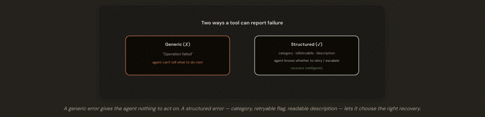
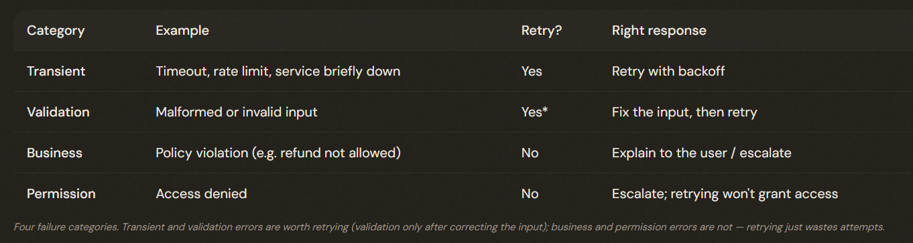
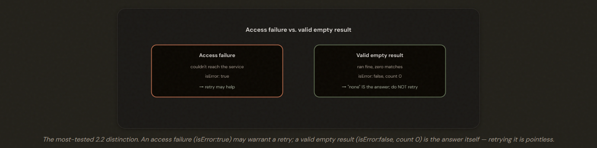
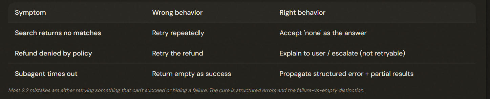

# 2.2 Structured Error Responses

## Why "Operation Failed" Is Useless to an Agent

A generic 'Operation failed' is useless to an agent because it can't decide what to do next. **STRUCTURED** error metadata — what kind of failure, and whether to retry — is what lets the agent recover intelligently.

---

## The Four Kinds of Failure

Distinguish 4 failure categories: 
1. Transient: Retry
2. Validation: Retry after fixing input
3. Business: Don't retry, escalate 
4. Permission Don't retry, escalate 
Returning the category plus an **isRetryable flag** prevents the agent from wasting retries on errors that can never succeed.

---

## The Distinction the Exam Tests Most: Failure vs Empty

1. The search service was unreachable: an ACCESS FAILURE. The agent genuinely doesn't know the answer; retrying might help. 
2. The search ran perfectly and returned zero matches — a VALID EMPTY RESULT. 'No matches' IS the answer; retrying is pointless and will just return zero again.

---

## Errors in a Multi-Agent System

In multi-agent systems, subagents recover from transient failures LOCALLY, and propagate only non-recoverable errors UP — with the category, what was attempted, and partial results. Never silently swallow an error by returning empty-as-success; that hides gaps from the coordinator.

*Solutions*:

1. Local Recovery: A subagent should handle transient failures itself. Retry that timeout locally before bothering the coordinator.

2. Structured Propagation: When a subagent hits a failure it genuinely can't resolve, it shouldn't just die or return an empty result pretending success. It should propagate UP to the coordinator a structured report. (the failure category, what it was attempting, and any partial results it managed to gather before failing)

---

## The Exam Traps

---

- ❌ **Retrying an empty result.** Treating 'zero matches' as a failure and retrying.
- ✅  A valid empty result (isError:false, count 0) IS the answer — don't retry.
---
- ❌ **Generic error messages.** Returning 'Operation failed' with no structure.
- ✅ Return category + isRetryable + a readable description so the agent can decide.
---
- ❌ **Retrying business errors.** Retrying a policy violation as if it were transient.
- ✅ Business and permission errors are not retryable — explain or escalate.
---
- ❌ **Silent suppression.** A subagent returning empty results marked 'success' on a timeout.
- ✅  Propagate a structured error with partial results so the coordinator sees the gap.

---

---