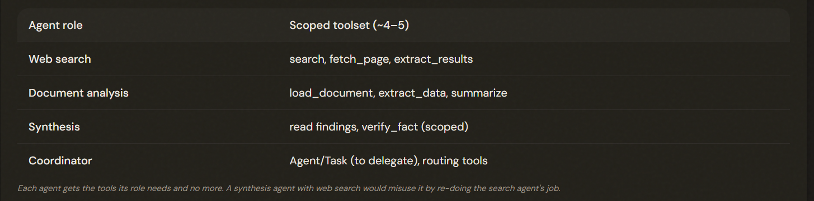
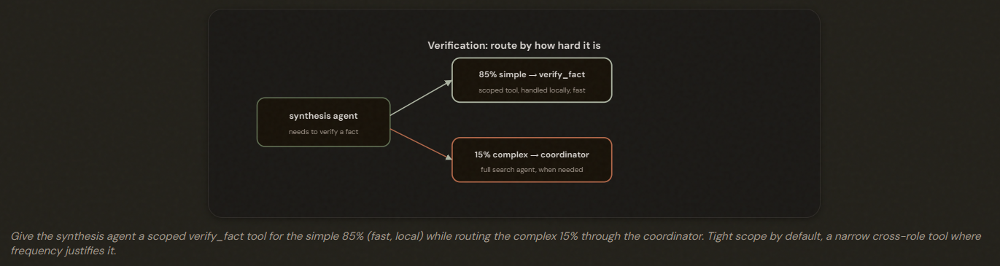
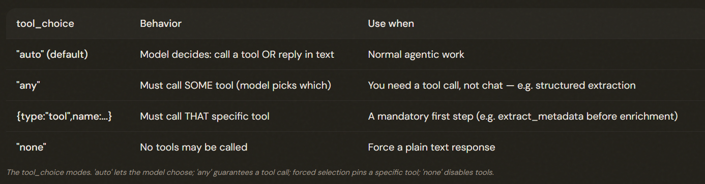

# 2.3 Tool Distribution & Tool Choice

## Can an Agent Have Too Many Tools?

More tools is not more capable. Giving an agent too many tools (≈18 vs a focused 4–5) degrades selection reliability by increasing decision complexity. Scope each agent's toolset to its role.

---

## Scoping Tools to Roles

Scope each agent's tools to its role. Agents given tools outside their specialization tend to misuse them (a synthesis agent doing web searches duplicates work). Role-scoped toolsets keep selection reliable and responsibilities clean.

---

## The 85% Case: Scoped Cross-Role Tools

Routing every cross-role need through the coordinator adds latency. For a high-frequency simple case (the 85%), give the agent a narrow, scoped cross-role tool (e.g. verify_fact) and route only the complex cases (15%) through the coordinator — not the full generic tool, which it would misuse.

---

## Controlling Tool Choice    

tool_choice controls selection:
- Auto: model decides. 
- Any: Must call some tool — guarantees structured output over chat. 
- Forced {type:'tool',name:...}: Must call a specific tool — e.g. a mandatory first step.
- None: No tools.

---

## The Exam Traps

---

- ❌ **Over-provisioning.** Giving the synthesis agent the full web_search tool so it 'can verify anything'.
- ✅ Give it a scoped verify_fact for the 85% simple case; route the 15% complex through the coordinator.
---
- ❌ **Routing everything centrally.** Sending every simple verification back through the coordinator (2–3 hops, +latency).
- ✅ Handle the common simple case with a scoped local tool.
---
- ❌ **Wrong tool_choice for structured output.** Leaving tool_choice on 'auto' when you MUST get a tool call (structured data).
- ✅ Use 'any' to guarantee a tool call.
---
- ❌ **Tool overload.**  Putting 18 tools on one agent.
- ✅  ~4–5 role-scoped tools per agent.

---