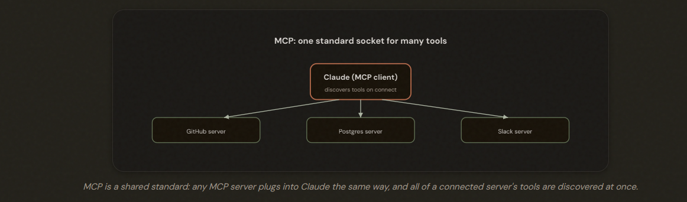
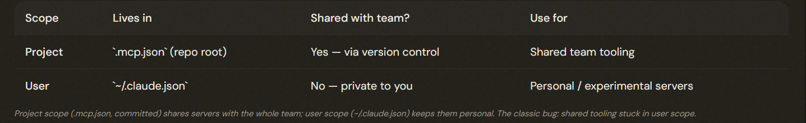
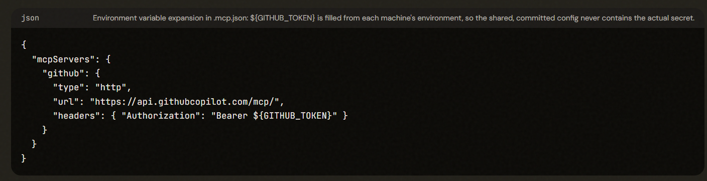
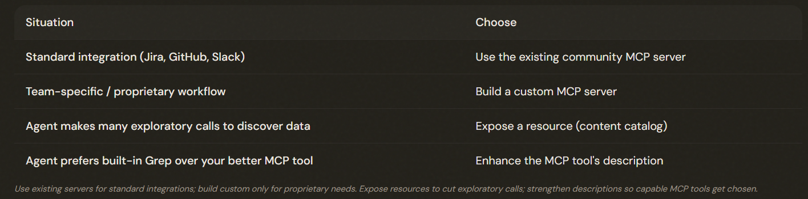

# 2.4 Integrating MCP Servers

## Where Do an Agent's Tools Come From?

MCP is a universal standard for connecting external tools to Claude. Connect an MCP server once and ALL its tools are discovered automatically and become available together — no per-tool wiring.

---

## Where the Configuration Lives: Scope

Project-scoped MCP servers live in .mcp.json (committed to version control, shared with the team); user-scoped servers live in ~/.claude.json (personal). If teammates lack a server everyone needs, it was put in user scope — move it to project scope.

---

## Keeping Secrets Out of Version Control

Use environment variable expansion (${VAR}, or ${VAR:-default}) in .mcp.json so a shared, version-controlled config references secrets like ${GITHUB_TOKEN} without ever committing the actual values — each machine supplies its own.

---

## Resources, and When to Build vs Use

MCP resources expose read-only content catalogs (issue summaries, doc hierarchies, schemas) so the agent can see what's available without exploratory calls. Use existing community servers for standard integrations; build custom only for team-specific/proprietary workflows.

---

## The Exam Traps

---

- ❌ **Wrong scope for team tooling.** Putting a server the whole team needs in user scope (~/.claude.json).
- ✅ Project scope (.mcp.json), committed to version control.
---
- ❌ **Committing secrets.** Hard-coding an API key in .mcp.json. 
- ✅ Use ${VAR} environment variable expansion so the secret stays out of the repo.
---
- ❌ **Building when you should reuse.** Writing a custom MCP server for a standard integration like Jira.
- ✅ Use the existing community server; build custom only for proprietary needs.
---
- ❌ **Sparse tool descriptions.**  Leaving MCP tools thinly described so the agent prefers built-in tools.
- ✅ Enhance the descriptions (Lesson 2.1) so capable MCP tools get selected.

---