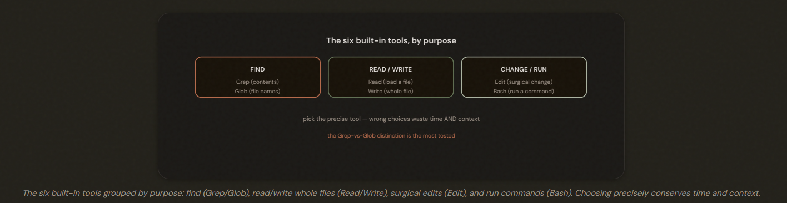
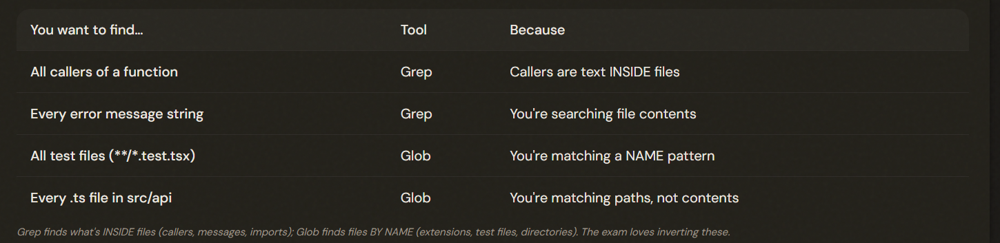
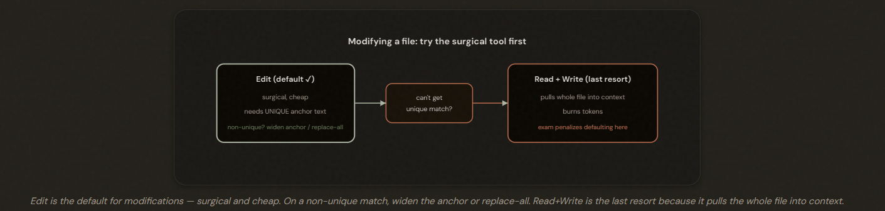
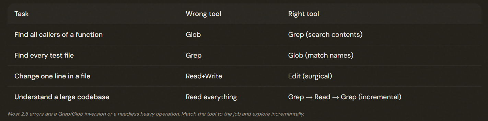

# 2.5 Selecting Built-in Tools

## The Six Tools Every Agent Already Has

Claude Code has six built-in tools — Read, Write, Edit, Bash, Grep, Glob. They're not interchangeable; picking the right one (especially Grep vs Glob) saves time and conserves context, which the exam rewards.

---

## Grep vs Glob — Inside Files vs File Names

1. Grep: Searches file **CONTENTS** (function callers, error messages, imports); 
2. Glob: Matches file **NAMES/paths** (e.g. **/*.test.tsx). 

---

## Edit vs Read+Write — Surgical vs Heavy-Handed

Edit is the default for file modifications (surgical, via unique text match). On a non-unique match, widen the anchor text or use replace-all — don't immediately jump to Read+Write, which pulls the whole file into context and burns tokens (the exam penalizes defaulting to it).

---

## Incremental Discovery — Don't Read Everything

*The single most important habit with built-in tools is to explore a codebase **INCREMENTALLY** rather than reading everything up front.*

Build codebase understanding incrementally: Grep to find entry points → Read only those to follow flow → Grep for usage → repeat, pulling in only what's needed. Never read all files upfront — it floods context and degrades reasoning.

---

## The Exam Traps

---

- ❌ **Glob to find callers.** Using Glob to find who calls a function. 
- ✅ Callers are content INSIDE files → Grep.
---
- ❌ **Grep for extensions.** Using Grep to find all .test.tsx files.
- ✅ That's a NAME pattern → Glob.
---
- ❌ **Reading all files upfront.** Loading the whole codebase to understand it.
- ✅ Incremental discovery: Grep → Read → Grep.
---
- ❌ **Defaulting to Read+Write.** Read+Write for a small change, or jumping to it on the first non-unique Edit match.
- ✅ Edit by default; on non-unique match widen the anchor or replace-all; Read+Write only as a true last resort.

---

---