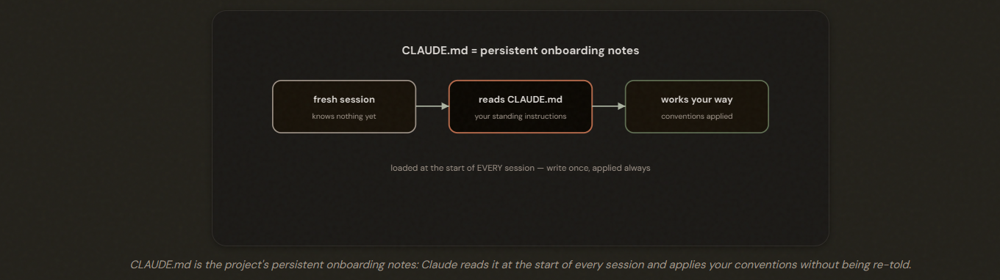
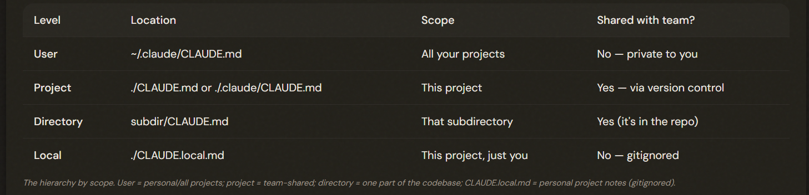
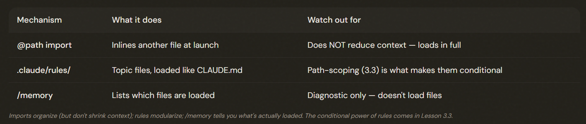
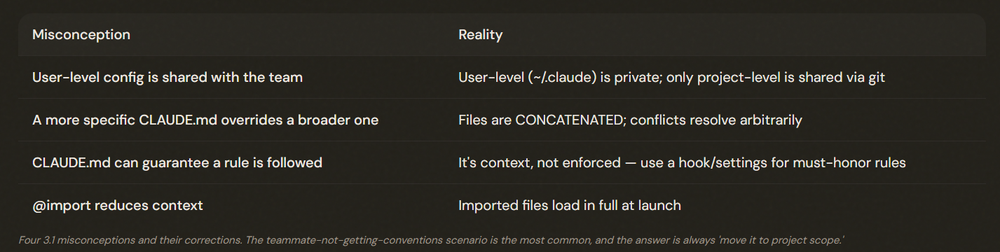

# 3.1 CLAUDE.md Hierarchy & Scoping

## How Claude Code Remembers Your Project

CLAUDE.md is where you write instructions you'd otherwise re-explain every session. Claude loads it at the start of every conversation. WHERE you place it in the hierarchy decides who receives those instructions.

1. How we build
2. Where things live
3. What to always do

Isn't one file in one place. It's a **HIERARCHY** of files at different levels, and where you put an instruction decides who it reaches.

---

## The Three Levels of the Hierarchy

Three levels: user (~/.claude/CLAUDE.md — personal, all projects, NOT shared), project (./CLAUDE.md or .claude/CLAUDE.md — team-shared via version control), and directory-level (a subdirectory's CLAUDE.md — scoped to that area). User-level is private; project-level is shared.

---

## How the Files Combine — Concatenation, Not Override

Claude.md: Regular user message after the system prompt

- ❌ More spesific wins.
- ✅ CLAUDE.md files are CONCATENATED, not overriding.

***Nothing replaces anything — it all gets combined.***

1. **Note**: The lesson: don't rely on one file *beating* another; instead, keep instructions consistent across files and review them for conflicts.
2. **Note2**: Claude md isnt guarantee. Must use tools for deterministic results.

---

## Modular Organization: Imports and Rules

Two mechanisms keep things modular as a project grows:
1. IMPORTS: The @path syntax pulls in another file inline. Writing `@./standards/naming.md` or `@README` in your CLAUDE.md inlines that file's contents at launch. Imports do **NOT reduce** context. The imported file is loaded in full at launch, just like the rest — so @import organizes, it doesn't shrink your token footprint. 

2. RULES: The .claude/rules/ directory holds topic-specific files (testing.md, api-conventions.md, security.md), each covering one area. By default these load at launch with the same priority as .claude/CLAUDE.md — so out of the box they're just a tidier way to organize the same always-on instructions. It lists exactly which CLAUDE.md and rules files are loaded in the current session — invaluable when instructions seem to be ignored and you need to confirm a file is actually being read.

Keep CLAUDE.md under ~200 lines (context + adherence). Use @path imports to organize (they inline at launch and do NOT reduce context) and .claude/rules/ to modularize by topic. Use /memory to verify which files are actually loaded.

---

## The Exam Traps

When a teammate isn't receiving conventions, the cause is user-level (private) config — move it to project-level and commit. Reject answers implying user-level is shared, that specificity overrides (it concatenates), or that CLAUDE.md enforces hard rules (use a hook). And there is no '.claude/config.json with a commands array.

---