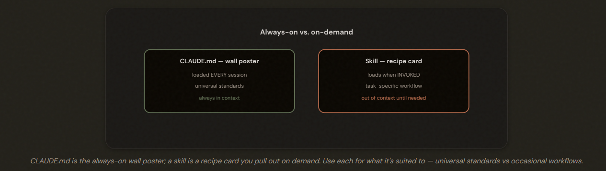
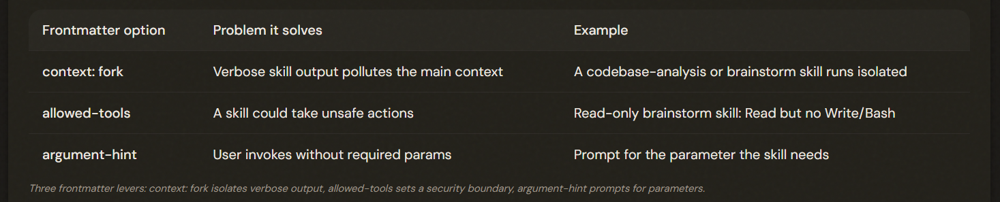

# 3.2 Custom Slash Commands & Skills

## The On-Demand Layer

Skills (and custom commands, now merged with them) package task-specific workflows that load ON DEMAND when invoked — unlike CLAUDE.md, which is always-on. Use skills for occasional procedures so they don't clutter every session's context.

---

## Where They Live: Project vs User Scope

Three key skill frontmatter options: context: fork (run in an isolated subagent so verbose output doesn't pollute the main context), allowed-tools (restrict the skill's tools — a security boundary), and argument-hint (prompt for required parameters when invoked without them).

---

## Skill or CLAUDE.md? Making the Right Choice

1. CLAUDE.md: ALWAYS
2. SKILL.md: Specific task

Invoke skill: 
- type its command (/review)
- Claude auto-invokes

---

## The Exam Traps

- ❌ **Wrong scope for a team command.** Putting a team /review in ~/.claude/commands/ (personal).
- ✅ .claude/commands/ in the project, committed to git.
---
- ❌ **Skills as always-on guidance.** Using a skill for universal standards Claude needs every session.
- ✅ That's CLAUDE.md; skills load on demand.
---
- ❌ **Task procedures in CLAUDE.md.** Putting a multi-step deploy procedure in CLAUDE.md (wastes context).
- ✅ Make it a skill, invoked when deploying.
---
- ❌ **Not isolating verbose skills.** A codebase-analysis skill dumping output into the main context.
- ✅  Use context: fork to run it isolated.

---
