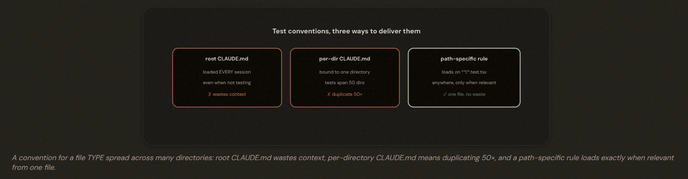
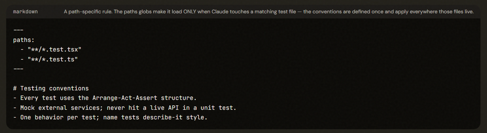
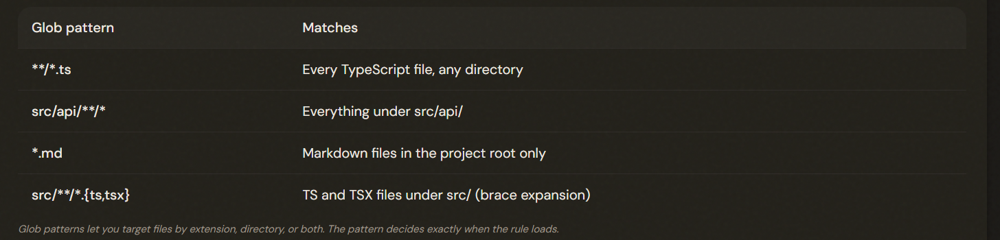
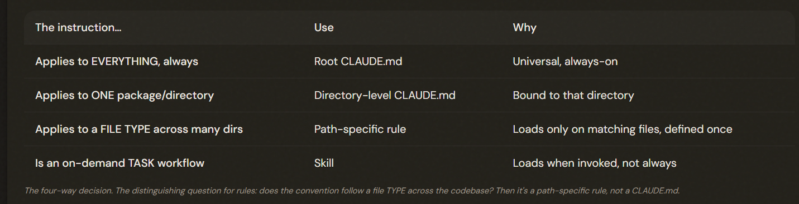

# 3.3 Path-Specific Rules

## The Problem: Conventions That Live Everywhere

### Conditional

Path-specific rules load instructions ONLY when Claude works with files matching a glob pattern. They're the right tool for conventions that apply to a file TYPE spread across many directories — conditional, not always-on, and defined once.

---

## How Path-Specific Rules Work

A path-specific rule is a .claude/rules/ file with a YAML paths field of glob patterns; it loads ONLY when Claude works with matching files. A rule without paths loads unconditionally. This is how you make instructions conditional on file type or location.

---

---

## Choosing the Right Mechanism

Universal → root CLAUDE.md; one package → directory CLAUDE.md; a file TYPE across many directories → path-specific rule; an on-demand task workflow → skill. The path-specific rule is uniquely suited to conventions that follow a file type regardless of where those files live.

---

## The Exam Traps

For conventions on a file TYPE spread across many directories, choose a path-specific rule with a glob.

> ✅ A .claude/rules/ file with a paths glob — automatic and defined once.
>
> ❌ A skill (needs invocation / isn't automatic per-file).
>
> ❌ Directory-level CLAUDE.md (bound to one dir, can't span many).
>
> ❌ Root CLAUDE.md (loads always, wastes context).

---
