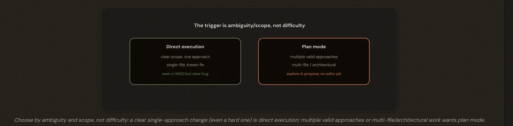
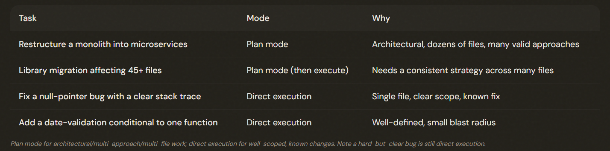

# 3.4 Plan Mode vs Direct Execution

## Look Before You Leap — Sometimes

Plan mode explores and proposes an approach WITHOUT modifying files; direct execution makes the change directly. The choice is about AMBIGUITY and scope (how many valid approaches, how many files, architectural decisions), NOT about difficulty.

---

## When to Use Each

Plan mode: large-scale/architectural changes, multiple valid approaches, multi-file consistency, or needed exploration. Direct execution: single-file, clear-scope, known-approach changes (even hard ones). Hybrid: plan the approach, then execute it file-by-file (e.g. a library migration).

---

## Plan Mode and the Explore Subagent

During plan mode, Claude can use the Explore subagent to isolate verbose discovery output — Explore reads and searches in its own context and returns a summary, preserving the main conversation's context for the real work

---

## The Exam Traps

- ❌ Start direct, switch to plan if complexity emerges
- ✅ If complexity is stated, choose plan mode up front
---
- ❌ Hard bug → plan mode (because it's hard)
- ✅ A clear single-fix bug → direct execution, despite difficulty
---
- ❌ Plan mode for a one-line validation change
- ✅ Direct execution — well-scoped, known
---
- ❌ Direct execution for a 45-file migration
- ✅ Plan mode (then execute) — multi-file strategy

---
