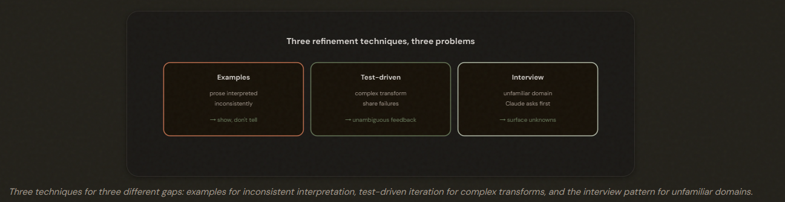
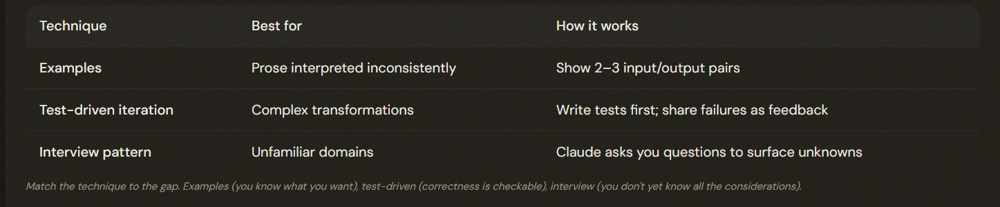

# 3.5 Iterative Refinement Techniques

## When the First Attempt Isn't Right

Effective iteration means matching the refinement technique to WHY the output is off. Repeating prose instructions is the blunt default; examples, test-driven iteration, and the interview pattern each solve a different kind of gap faster.

---

## Examples: Show, Don't Tell

Concrete input/output examples are the most effective fix when prose is interpreted inconsistently. **2–3** examples communicate the expected transformation better than more prose. When output varies run-to-run, show examples rather than rewriting the description.

---

## Test-Driven Iteration and the Interview Pattern

Test-driven iteration suits complex transformations — share test FAILURES as unambiguous feedback. The interview pattern suits unfamiliar domains — have Claude ask questions first to surface considerations you'd have missed. They solve different problems and aren't interchangeable.

---

## Batch vs Sequential Feedback

1. Interacting → Batch (One Message)
2. Independent → Sequential (Fix, Validate, Next)

Deliver interacting fixes together in a single message (so Claude reconciles them coherently); deliver independent issues sequentially (cleaner, one at a time). The discriminator is whether the fixes interact with each other.

---

## The Exam Traps

- ❌ **More prose for inconsistent interpretation.** Rewriting the description yet again when output varies run-to-run.
- ✅ Give 2–3 concrete input/output examples.
---
- ❌ **Confidence thresholds for judgment.** Adding 'be confident' style instructions. 
- ✅ Examples or tests, depending on the gap.
---
- ❌ **Interview pattern vs examples mix-up.**  Using the interview pattern when you know exactly what you want (just can't describe it).
- ✅ Use examples; reserve the interview pattern for unfamiliar domains where you don't yet know the considerations.
---
- ❌ **Wrong batch/sequential choice.** Batching independent issues or sequencing interacting ones.
- ✅ Interacting → one message; independent → sequential.

---
