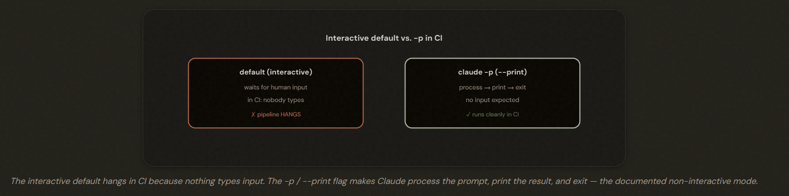
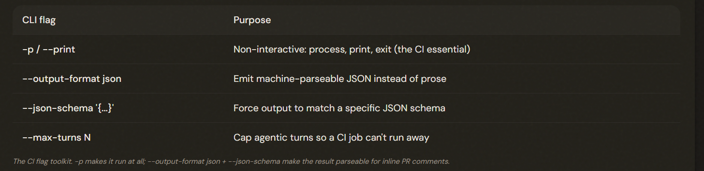
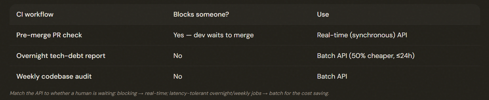

# 3.6 Integrating Claude Code into CI/CD

## Claude Without a Human at the Keyboard

The -p (or --print) flag runs Claude Code non-interactively: process the prompt, print the result, exit. It's THE answer to 'my CI job hangs waiting for input' — the most-tested fact in this domain.

---

## Structured Output for Automation

Use --output-format json with --json-schema to produce machine-parseable, schema-conforming output that a pipeline can post as inline PR comments. --max-turns and --max-budget-usd bound a non-interactive run. Note the fake distractors: CLAUDE_HEADLESS and --batch are not real.

---

## Why a Fresh Instance Reviews Better

*It's already convinced itself the code is right.*

A session that generated code is weaker at reviewing it (it retains and confirms its generation reasoning) — use a **SEPARATE** claude -p invocation with no prior context for independent review. For re-runs, pass prior findings and report only new/unaddressed issues to avoid duplicate comments.

---

## Real-Time vs Batch in CI

- Real Time: Immediatly
- Batch API: Routine

In CI, use the real-time synchronous API for BLOCKING workflows (pre-merge checks where a developer waits) and the Message Batches API for latency-tolerant ones (overnight/weekly reports) to capture its ~50% cost saving. Match the API to whether someone is waiting.

---

## The Exam Traps

- ❌ **Fake non-interactive flags.** CLAUDE_HEADLESS=true, --batch, or a stdin redirect to fix a hanging CI job.
- ✅ The documented answer is -p (or --print).
---
- ❌ **Self-review in the same session.** Asking the generating session to review its own code. 
- ✅ Use a separate claude -p invocation with no prior context.
---
- ❌ **Duplicate review comments.** Re-running a full review on new commits and re-flagging everything.
- ✅ Pass prior findings; report only new/unaddressed issues.
---
- ❌ **Batch for blocking work.** Using the Batch API for a pre-merge check (devs wait up to 24h).
- ✅ Real-time for blocking; batch only for latency-tolerant jobs.

---
