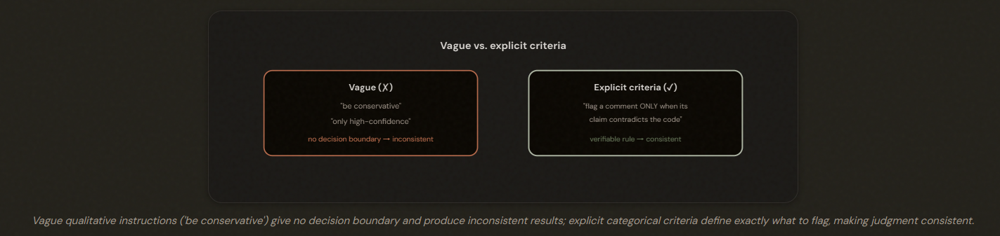
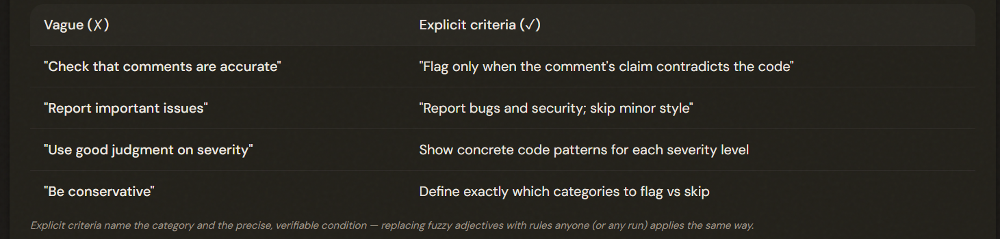

# 4.1 Prompts with Explicit Criteria

## Why 'Be Careful' Doesn't Work

Vague instructions ('be conservative', 'only high-confidence') give Claude no decision boundary and produce inconsistent results. Replace them with EXPLICIT categorical criteria that state exactly what to flag and what to skip.

---

## Writing Explicit Criteria

Write specific, verifiable criteria: name which categories to report (bugs, security) vs skip (style), and define conditions precisely ('flag only when the claim contradicts the code'). For severity, show concrete code patterns per level rather than prose adjectives.

---

## The False-Positive Trust Problem

- Temporarily DISABLE: Problematic category. After will refine its criteria with explicit examples.

A high false-positive rate in ONE category erodes trust in ALL categories. The counterintuitive fix: temporarily DISABLE the problematic category while you refine its criteria with explicit examples — restoring trust in the rest — rather than just nudging a confidence threshold.

---

## Why Confidence Filtering Isn't the Answer

- Model self-confidence is **POORLY CALIBRATED**.

Model self-confidence is poorly calibrated, so confidence-based filtering is a weak PRIMARY strategy — it lets confident errors through. Fix precision with explicit criteria first; use confidence routing only as a secondary refinement (and calibrate it against labeled data — see 5.5).

---

## The Exam Traps

- ❌ **Vague instruction as a fix.** 'Tell it to be more conservative' to reduce false positives.
- ✅ Write explicit categorical criteria for what to flag vs skip.
---
- ❌ **Confidence threshold as the cure.** 'Raise the confidence threshold' for a noisy category.
- ✅  Disable the category, refine its criteria with
---
- ❌ **Keeping a noisy category live.** Leaving the 40%-FP category active while you tweak it.
- ✅ Disable it to restore trust in the others, fix it offline.
---
- ❌ **Trusting self-confidence.** Filtering findings purely on the model's self-rated confidence.
- ✅ Explicit criteria first; confidence only as a calibrated secondary signal.

---
