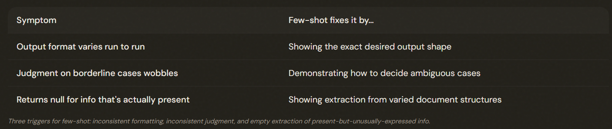
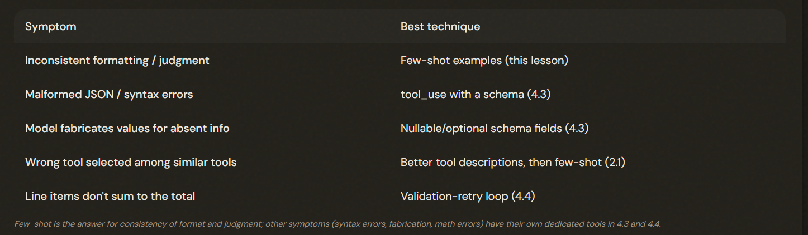

# 4.2 Few-Shot Prompting

## When Telling Isn't Enough, Show

Few-shot prompting — showing 2–4 worked input/output examples — is THE most effective technique for consistent, actionable output, more so than more instructions, confidence thresholds, or temperature changes.

---

## The Three Triggers for Few-Shot

Reach for few-shot when (1) formatting is inconsistent despite detailed instructions, (2) judgment on ambiguous cases wobbles, or (3) extraction returns empty/null for information that actually exists in the source. Examples solve all three.

---

## Constructing Examples That Teach

Three construction rules: 

1. Use 2 to 4 **TARGETED** examples. Focused on the scenarios that are actually failing.

2. Each example should show the **REASONING**, not just the answer. Explains **WHY** that one tool was chosen.

3. Cover the **FAILING** scenarios specifically.

---

## Constructing Examples That Teach

⚠️ **Note**: Few-shot is powerful but not universal.

Few-shot is the go-to for inconsistent formatting and judgment, but match technique to symptom: tool_use+schema for JSON syntax (4.3), nullable fields for fabrication (4.3), and validation-retry for math/semantic errors (4.4) — not few-shot.

---

## The Exam Traps

- ❌ **More instructions for inconsistency.** Adding yet another paragraph of detail when output is inconsistent. 
- ✅ Provide 2–4 examples — they outperform more prose.
---
- ❌ **Confidence/temperature for consistency.** Reaching for confidence thresholds or temperature to fix wobbling judgment.
- ✅  Few-shot examples showing how to decide.
---
- ❌ **Treating examples as literal patterns.** Believing the model only matches the exact examples shown.
- ✅ Well-built examples (with reasoning) teach it to generalize to novel cases.
---
- ❌ **Few-shot for the wrong symptom.** Using few-shot to guarantee JSON structure or stop fabrication.
- ✅ That's tool_use + nullable schema (4.3).

---
