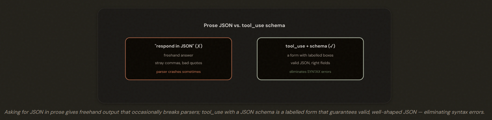
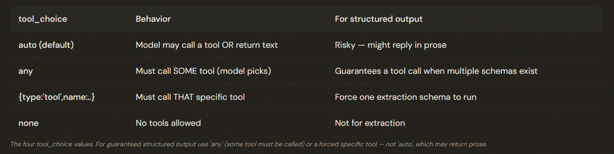
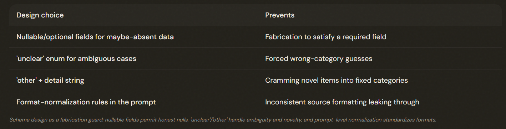

# 4.3 Structured Output with Tool Use

## Getting Output a Program Can Trust

Tool_use with a JSON schema is the most reliable way to get schema-compliant structured output — it eliminates JSON SYNTAX errors. Define a tool whose schema IS the structure you want, and read the data out of the tool call.

---

## Controlling Whether and Which Tool Is Called

*tool_choice has exactly four values:* 

1. auto: May return text
2. any: Must call some tool
3. {type:'tool',name}: Forced specific tool
4. none

For guaranteed structured output use **'any'** or a **forced tool** — not 'auto'. Add **strict:true** to also guarantee schema-valid inputs.

---

## The Critical Limit: Structure Isn't Correctness

tool_use with a JSON schema eliminates *SYNTAX* errors but *NOT SEMANTIC* errors — a schema-valid result can still have line items that don't sum, values in the wrong field, or fabricated data. Schema guarantees structure, not correctness.

### tool_use: 
- ✅ Guarantees the **SHAPE** of the output. Valid JSON, all required fields present, correct types. 

- ❌ It does NOT guarantee the output is **CORRECT**. The schema can't check that the **VALUES** are right.

---

## Schema Design to Prevent Fabrication

⚠️ **Note**: If you mark every field REQUIRED the model FABRICATES one to satisfy the requirement.

Make maybe-absent fields OPTIONAL/NULLABLE so the model can return an honest null instead of fabricating a value to satisfy a required field. Add an 'unclear' enum for ambiguity and 'other'+detail for novel cases, and put format-normalization rules in the prompt.

---

## The Exam Traps

- ❌ **Thinking tool_use guarantees correctness.** Assuming a schema-valid extraction is right.
- ✅ It's structurally valid only; semantic errors (sums, misplaced values, fabrication) still need validation (4.4).
---
- ❌ **Wrong tool_choice for structure.** Leaving tool_choice on 'auto' when you must get structured output. 
- ✅ Use 'any' (or a forced tool); **add strict:true**.
---
- ❌ **All fields required.** Marking every field required, pressuring fabrication of absent data.
- ✅ Make maybe-absent fields nullable for honest nulls.
---
- ❌ **Confusing auto/any/tool.** Mixing up the four tool_choice values.
- ✅ auto may return text; any forces some tool; tool forces a specific one; none disables tools.

---
