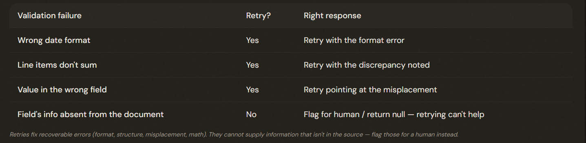

# 4.4 Validation & Retry Loops

## Catching the Errors the Schema Lets Through

Validate the output, and when it's wrong, retry WITH the specific error: send the original document, the failed extraction, and the exact validation error so the model self-corrects — rather than a naive retry that just repeats the mistake.

---

## What Retries Can and Can't Fix

### The deciding question: is the information actually THERE to get right?

Retries fix recoverable errors — format mismatches, structural errors, misplaced values, math errors — where the answer is derivable from the input. They CANNOT fix information ABSENT from the source (or needing external knowledge); flag those for a human or return null instead of retrying.

---

## Building Self-Correction Into the Schema

1. Instead of computing the total separately and comparing, have the extraction return BOTH a calculated_total AND the stated_total. Now a discrepancy is visible right in the output. Your validator just compares two fields, and the model itself is prompted to notice when they disagree.

2. Add a conflict_detected boolean for sources that contradict each other, so inconsistency is flagged rather than silently resolved. Add a detected_pattern field that records WHICH code construct triggered a finding.

Design schemas for self-correction: extract calculated_total alongside stated_total so discrepancies are visible; add conflict_detected booleans and detected_pattern fields. Validation-retry targets SEMANTIC errors — syntax errors are already eliminated by tool_use (4.3).

---

## The Exam Traps

- ❌ **Naive retry.** Re-running the same prompt and hoping.
- ✅ Retry WITH the document, the failed output, and the specific error.
---
- ❌ **Retrying for absent info.** Retrying when the needed value isn't in the source.
- ✅ Flag for a human or return null — retrying can't supply missing data and may cause fabrication.
---
- ❌ **Treating syntax and semantic errors the same.** Using retry loops for JSON syntax.
- ✅ tool_use already eliminates syntax (4.3); retry-validate is for *semantic* errors.
---
- ❌ **Not surfacing the error.** Computing totals entirely outside the model.
- ✅ Have the schema return calculated vs stated values so discrepancies are visible.

---
