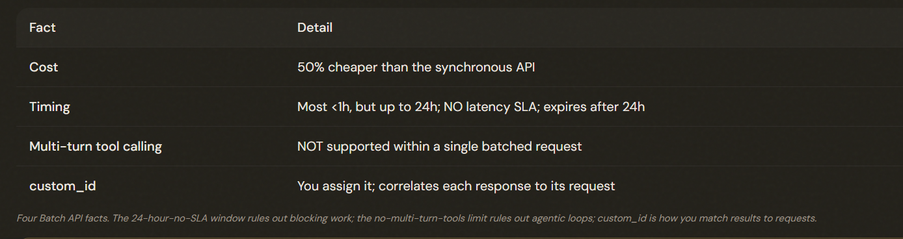

# 4.5 Batch Processing Strategies

## Processing Thousands of Documents Cheaply

The Message Batches API processes large volumes at 50% lower cost, asynchronously. The whole decision is whether the workload is latency-tolerant (use batch) or someone is waiting on it (use real-time).

---

## The Numbers That Decide

The Batch API: 50% cheaper, up to a 24-hour window with NO latency SLA (expires after 24h), does NOT support multi-turn tool calling in a request, and uses custom_id to correlate each response to its request.

⚠️ **Note**: Batch requests are *one-shot*. You can't execute a tool mid-way and feed the result back. 

---

## The Matching Rule: Blocking vs Latency-Tolerant

Match the API to latency tolerance: synchronous (real-time) for BLOCKING workflows (pre-merge checks, user-facing requests where someone waits); Batch API for LATENCY-TOLERANT workflows (overnight/weekly reports) to capture the 50% saving. Evaluate each workflow separately — not all-or-nothing.

---

## Running Batches Well

### Two practices make it cost-effective:
1. Handle failures by custom_id: When some requests in a batch fail, don't resubmit the whole batch. Use the custom_id to identify ONLY the failures and resubmit just those, with modifications.

2. REFINE on a small sample BEFORE running the full batch: Take 5–10 representative documents, iterate your prompt until the first-pass success rate is high, THEN launch the big batch. The math is compelling: at a 90% first-pass rate, 1,000 documents need ~100 retries; at 60%, they need ~400. 

---

## The Exam Traps

- ❌ **Batching a blocking workflow.** Moving a pre-merge check to batch for the savings.
- ✅ Blocking work stays on the synchronous API; only latency-tolerant work goes to batch.
---
- ❌ **Assuming batch is fast.** 'It usually finishes in an hour, so it's fine for blocking work.' 
- ✅ There's NO SLA — it can take up to 24h; never rely on it being fast.
---
- ❌ **All-or-nothing thinking.** Moving every workflow to batch (or none).
- ✅  Evaluate each: batch the tolerant ones, keep blocking ones real-time.
---
- ❌ **Multi-turn tools in a batch.** Running an agentic tool-calling loop inside a batched request.
- ✅ Batch doesn't support multi-turn tool calling — use the synchronous API for that.

---
