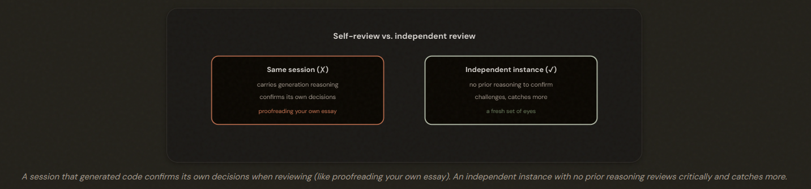
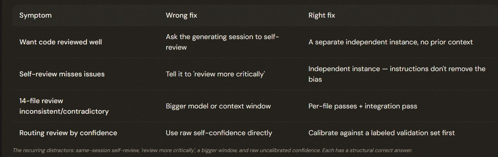

# 4.6 Multi-Instance & Multi-Pass Review

## Who Watches the Watcher?

⚠️ **Note**: Self-review is structurally biased toward approval. To prevent this:

1. Using an INDEPENDENT instance to review
2. MULTI-PASS review

A model reviewing its OWN work in the same session tends to confirm its generation reasoning rather than challenge it. Use an INDEPENDENT instance (no prior context) for an honest review, and multi-pass review to avoid attention dilution on large reviews.

---

## Independent Review Beats Self-Review

Use an INDEPENDENT Claude instance (no prior context) to review generated output — it has no generation reasoning to confirm and catches more. Self-review instructions ('review critically') or extended thinking in the SAME session don't remove the confirmation bias, because the biasing reasoning is still in context.

---

## Multi-Pass Review for Large Reviews

For large multi-file reviews, split into per-file LOCAL passes (consistent depth) plus a separate cross-file INTEGRATION pass (cross-cutting issues) to avoid attention dilution. A bigger context window does NOT fix it — the problem is attention quality, not capacity.

---

## Confidence Calibration for Routing

You CALIBRATE it against a LABELED validation set: measure what the model's confidence levels actually correspond to in reality, then set your routing thresholds based on that real mapping. Confidence routing is useful — but only after calibration turns a vibe into a measured probability.

Confidence-based routing (high → developers, low → human review) concentrates review effort, but raw self-reported confidence is poorly calibrated — calibrate it against a labeled validation set before setting thresholds (revisited in Domain 5.5).

---

## The Exam Traps

---

- ❌ Same-session self-review (or 'review critically' / extended thinking in-session) — the generation reasoning still biases it.
- ❌ A bigger model/window for an inconsistent large review (it's attention dilution).
- ❌ Raw self-confidence for routing.
- ✅ Independent instance, per-file + integration passes, and calibrated confidence.

---

---

