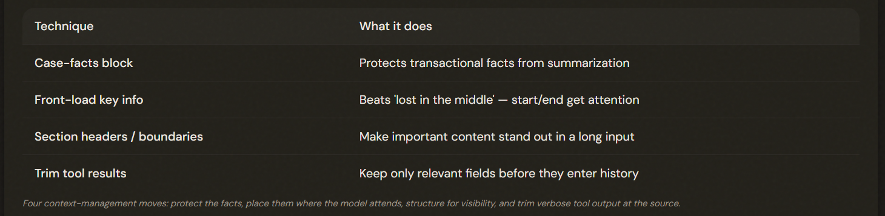

# 5.1 Managing Conversation Context

## Why 'Be Careful' Doesn't Work

⚠️ **The Problem**: Customer says: '$247.83 was charged for order id:#8891 on March 3rd.' Summarize that history and it becomes 'the customer wants a refund for a recent order.'

In long conversations, progressive summarization destroys transactional specifics (amounts, dates, IDs, customer-stated expectations). The fix is to keep those facts in a protected block that is NEVER summarized.

---

## The Persistent Case-Facts Block

ℹ️ Extract FACTS: {Id, Date, Price etc.}

Extract transactional facts (customer ID, order #, amounts, dates, statuses) into a persistent 'case facts' block included in EVERY prompt, OUTSIDE the summarized history and never summarized — like a sticky note on the case file. Trim the history freely; the facts always survive.

---

## Lost in the Middle, and Trimming Tool Output

'Lost in the middle': models attend to the *BEGINNING* and *END* of long inputs and may miss the *MIDDLE* — front-load key findings and use clear section headers. And trim verbose tool results to relevant fields BEFORE they accumulate in history.

---

## The Exam Traps

- ❌ **Trusting summarization.** Assuming progressive summarization safely preserves details.
- ✅ It destroys transactional specifics — use a **persistent case-facts** block.
---
- ❌ **Prompt reminders for position.** Telling the model 'pay attention to everything' to fix lost-in-the-middle. 
- ✅ Use STRUCTURE — front-load key info, add section headers.
---
- ❌ **Keeping full tool results.** Letting 40-field tool payloads accumulate in history.
- ✅ Trim to the relevant fields before they enter context.
---
- ❌ **Selective truncation that loses facts.** Truncating history in a way that drops the amounts/dates.
- ✅ Protect facts in the case-facts block, then trim the rest.

---

