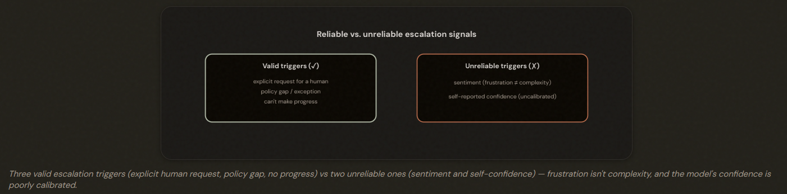
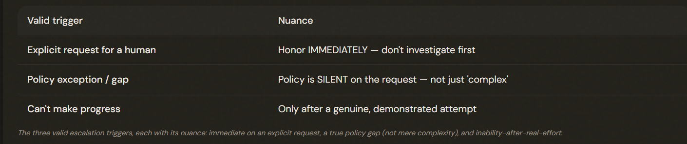
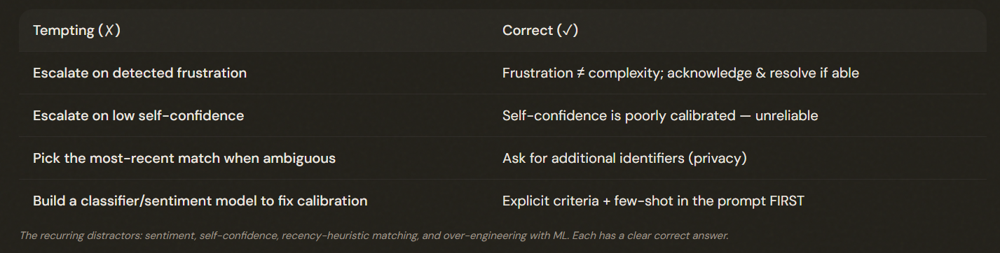

# 5.2 Escalation Ambiguity Resolution

## Knowing When to Hand Off

Escalate on three valid triggers — an explicit request for a human, a policy gap/exception, or an inability to make progress — NOT on the tempting-but-unreliable signals of customer sentiment or the model's self-reported confidence.

---

## The Three Valid Triggers

Three valid escalation triggers: (1) an explicit customer request for a human — honor it immediately; (2) a policy exception/GAP where policy is silent on the request (not just a complex case); (3) inability to make meaningful progress after a genuine attempt.

---

## The Two Unreliable Triggers

- ❌ Sentiment-Based Escalation: Detecting that a customer is frustrated and escalating on that.

- ❌ Self-Reported Confidence: Having the model rate its own confidence and escalate when it's low.

Two UNRELIABLE escalation triggers: sentiment (frustration ≠ complexity — a furious customer may have a one-step problem) and self-reported confidence (poorly calibrated — the model is often confidently wrong on hard cases). Acknowledge frustration and resolve when able; escalate only on a reiterated or explicit human request.

### Sentiment triggers case: 
- ℹ️ **ACKNOWLEDGE** the frustration and RESOLVE it. Escalating only if the customer then REITERATES that they want a human. 

---

## Ambiguous Matches and the Best Fix

### Demonstrating when to escalate versus resolve:

- ✅ Add EXPLICIT escalation criteria. 
- ✅ Few-shot examples to the system prompt.

---

### When a customer lookup returns MULTIPLE matches (two people with the same name):
- ✅ It must ask for ADDITIONAL IDENTIFIERS — an email, an order number, a postal code — to disambiguate.

---

## The Exam Traps

---

- ❌ Escalate on sentiment or self-confidence.
- ❌ Pick a customer by recency/activity when matches are ambiguous.
- ❌ Build a classifier/sentiment model to fix calibration.
- ✅ Escalate on the three valid triggers, ask for more identifiers on ambiguity, and add explicit criteria + few-shot to the prompt first.

---

---

