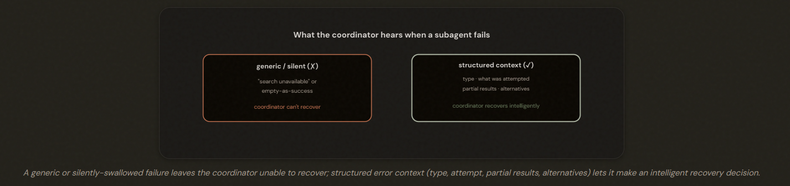
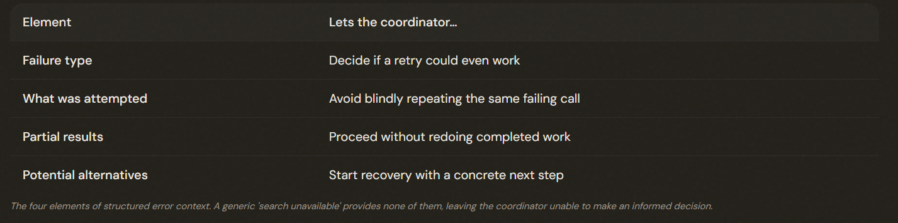

# 5.3 Error Propagation in Multi-Agent Systems

## When a Worker Fails, What Does the Boss Hear?

When a subagent fails, propagate **STRUCTURED** error context — failure type, what was attempted, partial results, and possible alternatives — so the coordinator can recover intelligently, rather than a generic status or a silent empty 'success.'

---

## Structured Error Context: Four Elements

Structured error context has four elements: failure type, what was attempted (query/params/target), partial results gathered before failure, and potential alternative approaches. Generic statuses ('search unavailable') hide all four and prevent informed recovery.

ℹ️ **Note**: Partial data may let the coordinator proceed without redoing work.

---

## The Two Anti-Patterns

### Two ways of handling subagent failures are specifically wrong:
- ❌ SILENT SUPPRESSION: A subagent catches an error and returns something like {results: [], status: 'success'}.

- ❌ WORKFLOW TERMINATION: One subagent fails, so the entire research pipeline aborts.

---

## Local Recovery and Coverage Annotations

ℹ️ Subagents recover from TRANSIENT failures locally (retry with backoff) and propagate only non-recoverable errors up with structured context + partial results. Synthesis output should carry COVERAGE ANNOTATIONS — which findings are well-supported vs which topics have gaps from unavailable sources.

### Two practices complete the picture:

1. LOCAL RECOVERY: A subagent should handle TRANSIENT failures itself before propagating anything.
2. COVERAGE ANNOTATIONS: When the synthesis stage produces the final output, it should annotate which findings are WELL-SUPPORTED versus which topic areas have GAPS because a source was unavailable.

---

## The Exam Traps

- ❌ **Silent suppression.** Returning empty results marked 'success' on a failure.
- ✅ Propagate structured error context with partial results.
---
- ❌ **Generic status.** Returning 'search unavailable' after exhausting retries. 
- ✅ Include type, attempt, partial results, alternatives.
---
- ❌ **Killing the workflow.** Aborting the whole pipeline on one subagent failure.
- ✅ Let the coordinator proceed with partial results / retry the failed part.
---
- ❌ **No local recovery.** Propagating every transient hiccup to the coordinator. 
- ✅ Retry transient failures locally; propagate only non-recoverable ones.

---
