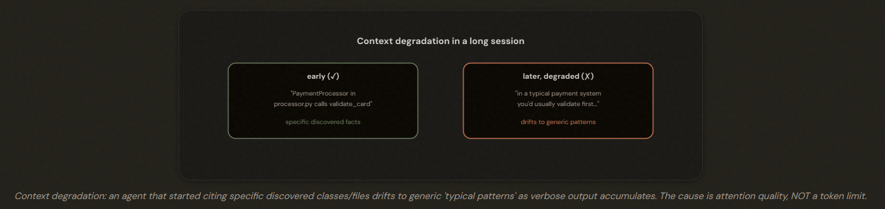
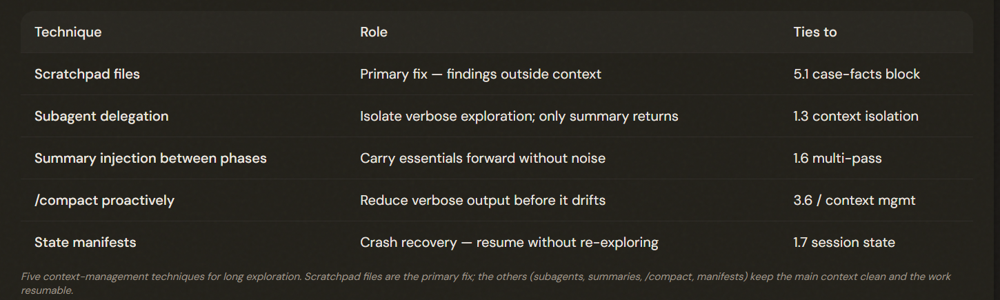

# 5.4 Context in Large Codebase Exploration

## The Agent That Forgets What It Found

In long exploration sessions, the agent drifts from specific discovered facts to generic 'typical patterns' — context degradation. The cause is attention quality as verbose output accumulates, NOT a token limit, so a bigger context window does NOT fix it.

---

## The Primary Fix: Scratchpad Files

### The scratchpad-file pattern: 
The agent writes its key discoveries — important classes, file paths, dependency chains — to a FILE on disk.

---

## Subagents, Summaries, and State Manifests

Beyond scratchpad files: delegate to subagents (primary benefit = context ISOLATION, not just parallelization), inject summaries between phases, use /compact PROACTIVELY (not only at the limit), and export structured state manifests so a long exploration is resumable after a crash.

---

## The Exam Traps

- ❌ **Bigger window for degradation** 'Use a larger context window' to stop the drift to generic patterns.
- ✅ It's attention quality, not capacity — use scratchpad files.
---
- ❌ **Delegation = parallelization only.** Thinking subagents only speed things up.
- ✅ Their primary benefit here is context *ISOLATION*, keeping the main context clean.
---
- ❌ **Restart without saving state.** Crashing and re-exploring everything from scratch.
- ✅ Export structured state manifests so you can resume.
---
- ❌ **/compact only at the limit.** Waiting until context is full to compact.
- ✅ Compact proactively during long sessions.

---
