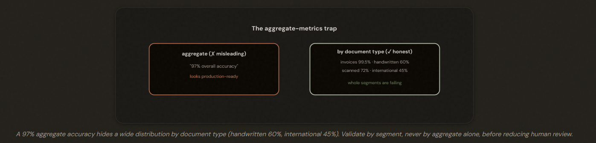
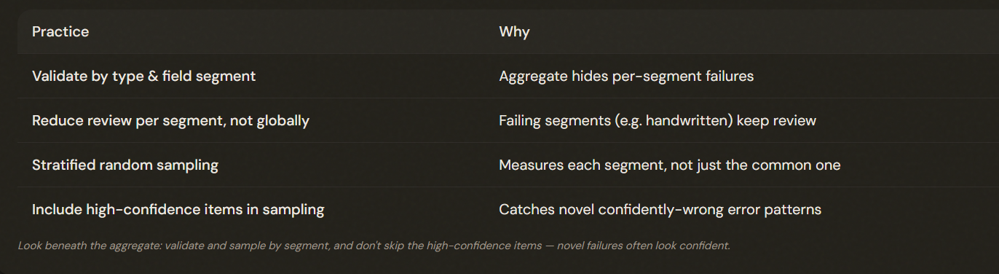

# 5.5 Human Review & Confidence Calibration

## When Can You Trust the Automation?

Aggregate accuracy metrics ('97% overall') **HIDE** poor performance on specific document types or fields. Validate by SEGMENT (document type and field), never aggregate alone, before reducing human review.

---

## Validate by Segment, Sample by Stratum

Validate accuracy by document TYPE and FIELD segment before reducing human review (validation-before-automation). Use stratified random sampling that INCLUDES high-confidence items — that's where novel, confidently-wrong error patterns hide.

### Stratified random sampling:
1. Divide the population into strata (by document type, say).
2. Sample from each. Crucially, include the **HIGH-CONFIDENCE** items in your sampling, not just the low-confidence ones.
3. ℹ️ You'd never catch if you only review low-confidence cases.

---

## Calibrating Confidence and Routing Review

- Raw self-reported confidence is **POORLY** calibrated. 
- Calibrate field-level confidence against a **LABELED** validation set to map reported confidence to true accuracy. 
- Then **ROUTE** highest-uncertainty / ambiguous items to human review first (a dynamic priority queue), not an even distribution.

---

## The Exam Traps

- ❌ **Trusting the aggregate.** Automating because overall accuracy is 97%.
- ✅ Validate by document type and field — segments may be failing (handwritten 60%, international 45%).
---
- ❌ **Raw confidence for automation.** Auto-accepting everything above 0.95 self-reported confidence.
- ✅ Calibrate against labeled data first — raw scores are poorly calibrated.
---
- ❌ **Sampling only low-confidence items.** Reviewing only what the model is unsure about.
- ✅ Stratified sampling that includes high-confidence items catches novel errors.
---
- ❌ **Even reviewer distribution.** Spreading reviewers evenly across all items.
- ✅ Route highest-uncertainty / ambiguous items first.

---
