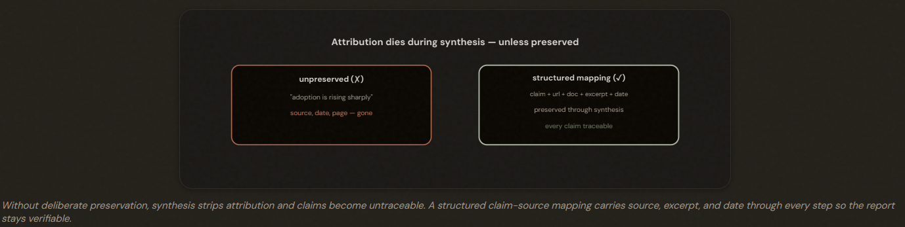
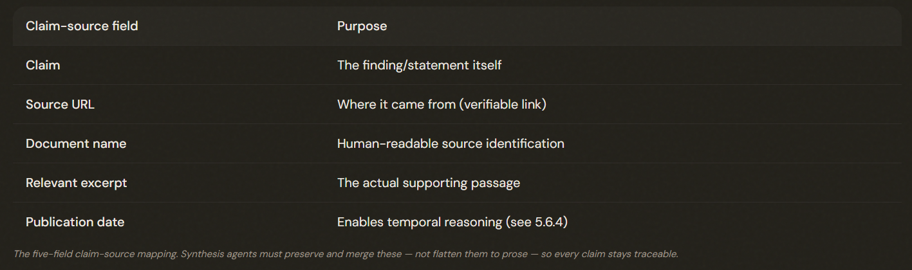
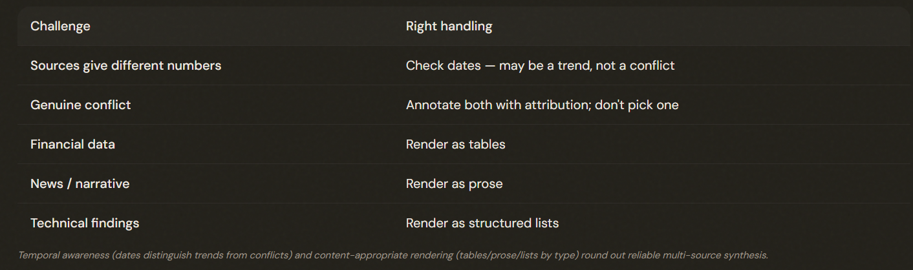

# 5.6 Information Provenance & Multi-Source Synthesis

## Where Did This Claim Come From?

*Attribution* dies during *summarization* unless you deliberately preserve it. Use a **STRUCTURED** claim-source mapping that synthesis agents carry through every step, so every claim in the final output remains traceable to its source.

---

## The Structured Claim-Source Mapping

Require subagents to output structured claim-source mappings (claim + source URL + document name + relevant excerpt + publication date) that downstream/synthesis agents PRESERVE and merge — never flatten to prose. This is the 1.3 structured-context-passing principle applied to synthesis.

---

## When Sources Conflict

When credible sources conflict, do NOT arbitrarily pick one value — annotate BOTH with their source attribution (and dates), and structure the report to distinguish well-established findings from contested ones. Surfacing the disagreement beats presenting a contested figure as settled fact.

- ❌ Pick one value and present it as the answer
- ✅ ANNOTATE both values with their attribution
---

## Temporal Data and Content-Appropriate Rendering

Require publication/collection DATES so temporal differences are read as TRENDS, not contradictions. And render content appropriately — financial data as tables, news as prose, technical findings as lists — rather than forcing everything into one uniform format.

---

## The Exam Traps

- ❌ **Letting attribution die.** Synthesizing claims into prose without source mappings. 
- ✅ Preserve structured claim-source mappings (claim + url + doc + excerpt + date) through synthesis.
---
- ❌ **Picking a winner on conflict.** Choosing the 'most recent' or one credible source's value and presenting it as fact.
- ✅ Annotate both with attribution; distinguish established from contested.
---
- ❌ **Misreading trends as conflicts.** Treating two different-dated figures as a contradiction.
- ✅ Use dates — it may be a trend, not a conflict.
---
- ❌ **Uniform rendering.** Converting everything to one format.
- ✅ Tables for financial, prose for news, lists for technical.

---
