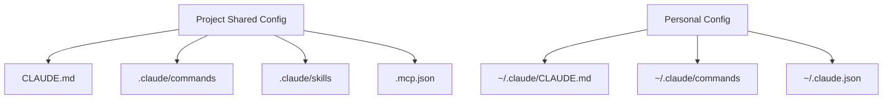

# 6. Last-Minute Memorization List

## Core Agent Loop & Flow

[tool_use] ──> [execute tool] ──> [append tool_result] ──> [continue]

[end_turn] ──> [stop] 

| Component | Purpose |
| --- | --- |
| **Prompt** | Guidance |
| **Gate / Hook** | Enforcement |
| **Tool Descriptions** | **Primary tool-selection signal.** |

---

## Coordination & Subagents

* **Context Isolation:** Subagents **do not** inherit context automatically.
* **Coordinator Role:** Controls **decomposition**, **routing**, **aggregation**, and **gap detection**.
* **Subagent Spawning:** Task tool spawns subagents; `allowedTools` must include `"Task"`.
* **Tool Fatigue:** Too many tools degrade selection reliability. Keep it lean.

---

## Tool Selection & File Operations

### **`tool_choice` Modes**

| Mode | Behavior |
| --- | --- |
| **`auto`** | May call tool |
| **`any`** | Must call **some** tool |
| **`forced`** | Must call **named** tool |

### **File Tool Selection Strategy**

* **`Grep`** ──> Content
* **`Glob`** ──> Paths
* **`Edit`** ──> Unique targeted change
* **`Read + Write`** ──> *Non-unique fallback*

---

## Configuration Directory

### Shared vs. Personal Configs

> **Path-Specific Rules:** Located in `.claude/rules` using **YAML paths**.

---

## CI, Validation & Batch

### **CI Commands & Schema**

* **Validation Command:** `claude -p --output-format json --json-schema`
* **Structured Output:** `tool_use` + JSON schema

> **The Gold Rule of Validation:**
> * **Schema** fixes *syntax*.
> * **Validation** fixes *meaning*.
> 
> 

### **Batch Processing Constraints**

* Latency-tolerant only.
* Use `custom_id` for correlation.
* **Must not** block pre-merge.

---

## Context Strategy

* Persistent case facts
* Structured issue state
* Claim-source mappings
* Scratchpads & Manifests
* Field-level confidence calibration