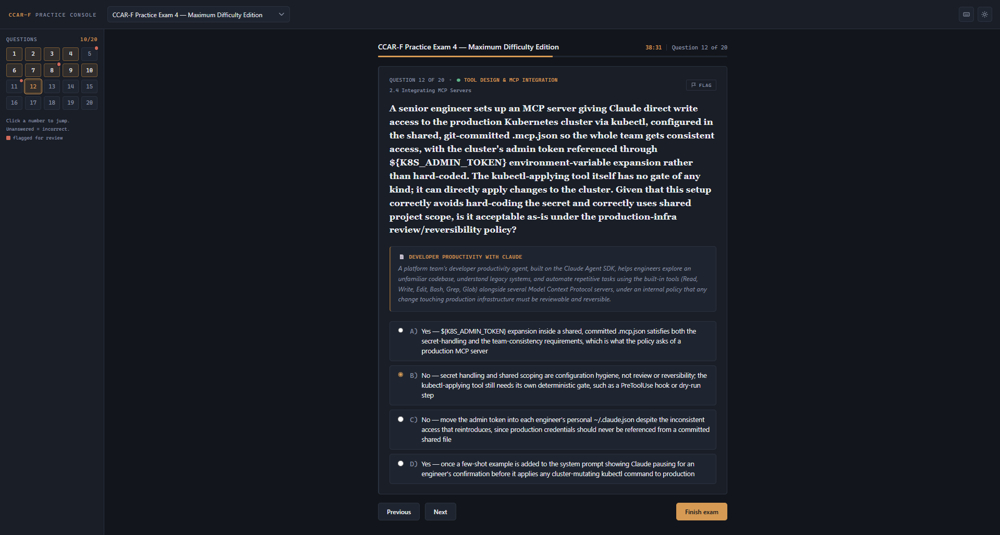
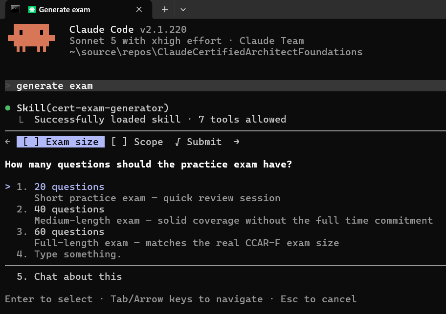
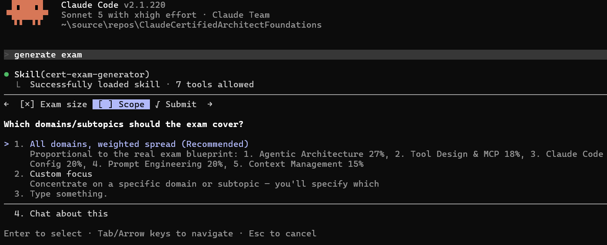

# Claude Certified Architect – Foundations (CCAR-F)

An original practice-exam **generator** and **simulator** for the **[Claude Certified Architect – Foundations](https://anthropic.skilljar.com/claude-certified-architect-foundations-access-request)** exam by Anthropic. A project skill for Claude Code and Codex authors question sets from a corpus of domain notes; a zero-build browser app delivers and scores them. Everything in the loop is a plain markdown file in this repo — there is no database, no backend, and no build step.



## How it works

The whole system is a file pipeline. Markdown is both the authoring format and the storage layer:

```
Notes/ + Data/  ──skill──▶  GeneratedExams/<id>/exam.md
                            GeneratedExams/<id>/answer-key.md
                                     │
                       sync-manifest.js derives manifest.json
                       validate-exams.js checks the format
                                     │
                            ExamSimulator fetches it
                                     │
                            GeneratedExams/<id>/result.md  (gitignored)
```

The design decisions worth knowing before reading the code:

- **Questions and answers are separate files on purpose.** `exam.md` carries the stem, domain, subtopic, and choices; `answer-key.md` carries correctness, per-option rationale, and source lessons. Nothing is duplicated, and the two are cross-referenced by `Q<n>`. This split is what makes timed mode leak-proof — the simulator can render a whole exam without ever fetching the key, and does exactly that until you finish.
- **`manifest.json` is a directory listing, not a config file.** Browsers can't enumerate a folder over `fetch()`, so the picker needs a manifest to know what exists. It's derived from disk by `scripts/sync-manifest.js` (a folder counts only if it contains an `exam.md`), never hand-edited, and a tracked pre-commit hook blocks any commit where it has drifted. That's why a freshly generated exam is selectable immediately: the skill writes the folder, then regenerates the index.
- **The markdown formats are a parser contract, so they're enforced.** Breaking one rarely raises anything — the simulator quietly drops a question or renders an empty badge instead. `scripts/validate-exams.js` checks every registered exam against the contract (header lines, `Total` vs question count, sequential numbering, domain and subtopic labels, four choices, `Correct:` letters that point at a real choice, `exam.md` ↔ `answer-key.md` agreement) and exits non-zero on a violation. It runs in CI on every push and pull request, in the pre-commit hook, and as the generator skill's final self-check. See [`ExamGenerator/README.md`](ExamGenerator/README.md#validation) for the full rule list.
- **`result.md` is the state store.** There's no progress database. Opening an exam does a `fetch()` probe for its `result.md`: found → your saved report is parsed back into a full review screen; not found → you get the mode prompt and start fresh. The presence of a file *is* the "already taken" flag. Consequently **Retake** doesn't reset a variable — it deletes the file, and the next probe misses.
- **Results are written back to the repo, then ignored by it.** A finished run is saved straight into `GeneratedExams/<id>/result.md` via the File System Access API, with the granted directory handle cached in IndexedDB so you authorize once per browser. `.gitignore` excludes those files — personal scores stay local — with a single negation for `_sample/result.md`, which is a synthetic worked example that documents the format.
- **The report format is a round-trip contract.** `result-md.js` holds both halves: `buildResultMarkdown()` writes the file and `parseResultReport()` reads it back. The shape isn't a report style you can restyle freely; the parser depends on it.
- **Scoring renormalizes.** Domains contribute weighted shares of 1000 points, but only domains actually present in the exam count — a D1-only drill still scores out of 1000, not out of 270.

## Quick start

Browsers block `fetch()` over `file://` (and ES modules only load over `http(s)`), so serve the folder over any local static server:

```bash
npx serve ExamGenerator
# or
python -m http.server --directory ExamGenerator 5500
```

Then open the printed localhost URL and load `ExamSimulator/index.html`.

If you plan to add exams, also enable the pre-commit hook once per clone — it re-derives `manifest.json` and validates every exam's format, so neither a stale index nor a broken exam can be committed (git doesn't honor `.githooks/` until pointed there):

```bash
git config core.hooksPath .githooks
```

## Generate an exam

Ask Claude Code or Codex — e.g. *"generate exam"* — which triggers the **`cert-exam-generator`** skill. The Claude Code definition lives in [`.claude/skills/`](.claude/skills/cert-exam-generator/SKILL.md), while the Codex-compatible definition lives in [`.agents/skills/`](.agents/skills/cert-exam-generator/SKILL.md). It needs two parameters and asks only for the ones you didn't already give it:

| How many questions? | Which domains? |
|---|---|
|  |  |

*(These screenshots show the skill's prompts in Claude Code; Codex asks for the same missing parameters. They are not simulator UI.)*

What it then does is mostly bookkeeping in service of one goal — questions that can't be answered without reading them:

1. **Grounds itself.** Reads the notes for the targeted subtopics plus the cheat sheets that encode the exam's answer logic. Every question must trace to a specific subtopic; if the note justifying the correct answer can't be pointed at, the question doesn't ship.
2. **Picks 4 of the 6 scenario families**, mirroring the real exam, and only pairs a question with a family whose primary domains cover that question's domain.
3. **Plans before writing** — the subtopic list, the domain counts, and the correct letters are laid out and balanced across A–D up front, then the order is shuffled so the exam doesn't read as domain-by-domain blocks.
4. **Audits option lengths.** This is the one that matters. The failure mode for generated exams is putting the justification in the correct option and leaving the distractors as bare assertions — which makes "always pick the longest choice" a winning strategy. The skill counts words per option, keeps the longest within ~1.25× the shortest, caps how often the longest option is the correct one, and pushes every "because…" clause into the answer key where it belongs.
5. **Registers the id** by regenerating `manifest.json` from disk, which is what makes the exam appear in the picker.
6. **Validates the result** with `scripts/validate-exams.js`, so the structural half of its self-check is machine-verified rather than asserted.

File formats, the scoring model, and the manual authoring path are documented in [`ExamGenerator/README.md`](ExamGenerator/README.md).

## Exam blueprint

The exam is scenario-based: 4 scenarios are drawn at random from a fixed pool of 6 production contexts, with scored items distributed across five content domains. Scoring is criterion-referenced on a **100–1000** scale with a cut score of **720** (72%).

| # | Domain | Weight |
|---|--------|--------|
| 1 | Agentic Architecture & Orchestration | 27% |
| 2 | Tool Design & MCP Integration | 18% |
| 3 | Claude Code Configuration & Workflows | 20% |
| 4 | Prompt Engineering & Structured Output | 20% |
| 5 | Context Management & Reliability | 15% |

The full blueprint — domain weights, the six exam scenarios, and how the exam is scored — lives in [`Data/exam-details.md`](Data/exam-details.md).

## Repository layout

```
.
├── ExamGenerator/            The generator's output + the browser simulator
│   ├── ExamSimulator/              Zero-build ES-module app (index.html + styles/ + js/)
│   └── GeneratedExams/             Practice exams (exam.md + answer-key.md per id)
├── Notes/                    Grounding corpus the generator draws from
│   ├── Anthropic Certifications/   30 lesson notes across the 5 domains (+ annotated screenshots)
│   └── Cheat Sheet/                Decision rules, scenario map, wrong-answer patterns
├── Data/                     Exam blueprint + the official exam guide PDF
├── Screenshots/              Images used by the READMEs
├── .claude/skills/           Claude Code skill definitions
├── .agents/skills/           Codex-compatible skill definitions
├── scripts/sync-manifest.js  Regenerates the exam manifest from folders on disk
├── scripts/validate-exams.js Checks every exam against the markdown format contract
├── .githooks/pre-commit      Blocks commits when the manifest is out of sync
└── sources.md                Links to the course and the real exam
```

## Grounding material

The generator is only as good as what it reads. Every question it writes must trace to a specific subtopic in these files — if a claim can't be sourced, the question doesn't ship.

- **`Notes/Anthropic Certifications/`** — 30 lesson notes organized by the five domains (`1.1` … `5.6`), each pairing distilled prose with annotated screenshots and explicit **Exam Trap** callouts that name the common distractors. These supply the subject matter and the `Source:` references that appear in every answer key.
- **`Notes/Cheat Sheet/`** — the answer *logic*: the [core decision rule](<Notes/Cheat Sheet/1-The Exam’s Core Decision Rule.md>) for picking between two plausible options, a scenario map, "if you see this, choose that" mappings, the top wrong-answer patterns (which become the distractors), and the out-of-scope topics that may only ever appear as distractors — plus one condensed sheet per domain.
- **`Data/exam-details.md`** — the blueprint: domain weightings and the six scenario families with their primary domains. The skill picks 4 of the 6 per exam, mirroring the real exam's behavior, and grounds each scenario narrative in these descriptions rather than inventing one.

Useful on their own as study material, too.

## Sources

The course, mock-exam providers, and the official exam link are collected in [`sources.md`](sources.md). Recommended starting point: the [Anthropic Certifications course](https://www.anthropiccertifications.com/courses/claude-certified-architect-foundations).

---

*Study material, not affiliated with or endorsed by Anthropic; “Claude” and related marks belong to Anthropic. The lesson notes and screenshots under `Notes/`, the blueprint in `Data/exam-details.md`, and the exam guide PDF derive from Anthropic and third-party course material, and are included here for study reference only. The generated exams in `ExamGenerator/GeneratedExams/` are original work, with the exception of `pdf/`, whose questions come from the official exam guide's own sample section.*
